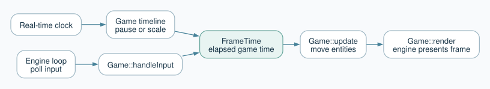
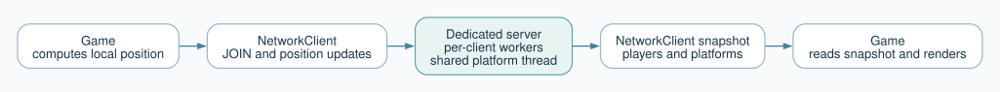
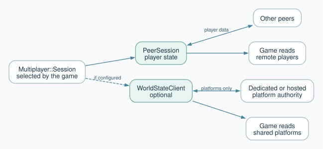

# Shared Engine

A reusable C++17 game-engine foundation built with SDL3 and ZeroMQ. The shared
code supplies a window and game loop, entities, physics, input, collision,
timekeeping, and networking. Applications supply their own rules and artwork.

A game implements `Game::handleInput()`, `Game::update()`, and `Game::render()`,
then passes itself to `Engine::run()`. The engine does not contain a particular
player, level, score, or win condition.

## Feature Map

### Project 2 (Milestone 2)

| Section | Shared-engine feature or demonstration | Main files |
| --- | --- | --- |
| 1. Time | Monotonic real-time source, pausable and rescalable timelines, per-consumer delta timers, and `FrameTime` for game movement. The engine also exposes a loop-iteration clock. | `include/TimeSource.hpp`, `include/Timeline.hpp`, `include/DeltaTimer.hpp`, `include/FrameTime.hpp`, `src/Engine.cpp` |
| 2. Networking | SDL-free protocol and nonblocking ZeroMQ client. A headless server keeps player sessions, positions, and server-owned moving platforms. | `include/NetworkProtocol.hpp`, `include/NetworkClient.hpp`, `include/NetworkServer.hpp`, `src/Network*.cpp` |
| 3. Multithreaded updates | Mutex-protected entities and timelines, plus independent delta timers, support game-managed parallel updates. The game synchronizes workers before collision checks and rendering. | `include/Entity.hpp`, `include/Timeline.hpp`, `include/DeltaTimer.hpp`, `src/Engine.cpp` |
| 4. Concurrent clients | The dedicated server gives joined players separate request/reply workers; one slow client need not block another. Demo clients can independently pause or scale their own game time. | `sandbox/NetworkServerMain.cpp`, `sandbox/MultiplayerDemo.cpp` |
| 5. Peer-to-peer and hybrid mode | Peers discover one another and send player state directly. An optional read-only world client obtains moving-platform state from a dedicated or player-hosted authority without joining its player roster. | `include/PeerSession.hpp`, `include/WorldStateClient.hpp`, `include/Multiplayer.hpp`, `src/PeerSession.cpp`, `src/WorldStateClient.cpp`, `src/Multiplayer.cpp` |

### Milestone 1 Foundations

| Task | Shared-engine feature | Main files |
| --- | --- | --- |
| 1. Engine setup and rendering | SDL3 initialization, a resizable window and renderer, the main loop, screen clear, frame presentation, and cleanup. The game chooses its window title and design size. | `include/Engine.hpp`, `src/Engine.cpp`, `include/Game.hpp` |
| 2. Entity | Position, dimensions, velocity, time-based movement, and a bounding rectangle. | `include/Entity.hpp`, `src/Entity.cpp` |
| 3. Physics | Configurable gravity applied only to entities selected by the game. | `include/Physics.hpp`, `src/Physics.cpp` |
| 4. Input | Polls the SDL keyboard once per frame and exposes held, just-pressed, and just-released keys, plus multi-key helpers. | `include/Input.hpp`, `src/Input.cpp` |
| 5. Collision | SDL-free rectangle overlap, intersection, separation, and resolution. The game decides what a collision means. | `include/Collision.hpp`, `src/Collision.cpp` |
| 6. Scaling | Constant/pixel and proportional/aspect-preserving rendering modes. `F1` toggles them by default; games may rebind or disable the key. | `include/Engine.hpp`, `src/Engine.cpp` |

## How The Pieces Fit

**Frame and time.** The engine polls input, obtains game-time delta, calls the
game update, and renders the frame. Real time keeps running during a game pause.



**Client-server mode.** The game sends its locally calculated position to the
dedicated server and reads back a snapshot of players and platforms.



**Peer-to-peer and hybrid mode.** Player state goes directly between peers.
If configured, a separate world client asks an authority only for platforms.



`engine-time`, `engine-geometry`, `network-core`, and `peer-core` do not link
SDL. The windowed `engine` library adds SDL on top, while the dedicated
`network-server` uses the networking and time libraries without a window.
For Section 3, games can use the thread-safe entity and time APIs to update
different objects concurrently, then wait for the updates before checking
collisions or rendering. `Engine::run()` does not create worker threads.

The public APIs are in `include/`, their implementations are in `src/`,
runnable examples are in `sandbox/`, and automated checks are in `tests/`.
For networking internals, see
[docs/networking-guide.md](docs/networking-guide.md).

## Build And Test

The SDL3 and ZeroMQ dependencies are Git submodules. From a new clone, run:

```bash
git submodule update --init --recursive
cmake -S . -B build
cmake --build build -j 4
ctest --test-dir build --output-on-failure
```

CMake also fetches Dear ImGui for the timeline sandbox during the first
configuration, so that first configure needs internet access unless the
dependency is already cached. Dear ImGui is not linked into the shared engine.
The test suite covers entities and physics, input, collision, timelines,
ZeroMQ, the network client/server, the peer mesh, and both multiplayer modes.

## Using The Engine

### Section 1: Time

`engine.realTime()` counts monotonic nanoseconds for networking and other
always-running work. `engine.gameTime()` is a timeline for simulation, and
`engine.loopTime()` counts loop iterations. The engine passes a `FrameTime` to
the game each frame with elapsed game seconds (`dtSeconds`) and absolute game
microseconds (`gameTimeUs`). `Entity::update()` accepts either `FrameTime` or a
float delta time, so movement can use elapsed time rather than a fixed distance
per frame.

Use `engine.gameTime().togglePause()` to pause the simulation and
`engine.gameTime().setScale(0.5)` or `engine.gameTime().setScale(2.0)` to
change its speed. While paused, game-time deltas become zero, but real time
keeps advancing so input, rendering, and network retries can continue.
`Timeline` also supports adjustable tic size and child timelines. Each
`DeltaTimer` measures elapsed tics for its own consumer and can cap a long
frame delta. `loopTime()` records iterations; it does not set the frame rate.

### Section 2: Client-Server Networking

`NetworkClient` connects to a headless `NetworkServer` over ZeroMQ. Start the
client and call `poll()` each frame. It first sends `JOIN`; the server assigns
a player ID and returns an initial world snapshot. The client then uses
`submitPosition(x, y)` to report its locally calculated position, and
`snapshot()` provides the latest positions of connected players and moving
platforms. A demo client sends its position even when it is not moving so
the server knows it is still present.

`poll()` checks for replies without stopping the game loop. The server owns
membership and platform motion, but character controls and movement stay in
the client. Connection timeouts and retries use real time, so they still work
when the client's game timeline is paused.

The `NetworkProtocol` messages are:

| Message | Sent by | What it does |
| --- | --- | --- |
| `JOIN` | Client | Requests a player session. |
| `WELCOME` | Server | Returns the assigned player ID, initial snapshot, and a private worker address when used. |
| `POSITION` | Client | Sends the player's latest position, optional game data, and sequence number. |
| `SNAPSHOT` | Server | Returns the current player and platform states after a position update. |
| `LEAVE` | Client | Requests removal from the player session. |
| `GOODBYE` | Server | Confirms that the player has left. |
| `ERROR` | Server | Reports an invalid request, rejected update, or unavailable session. |
| `GET_WORLD` | Hybrid peer's world client | Requests platform state without joining as a server player (Section 5). |
| `WORLD_STATE` | Platform authority | Returns platform state only, with no player data (Section 5). |

`Disconnected`, `Connecting`, `Connected`, and `Error` are local client
connection states, not messages sent over the network.

### Section 3: Multithreaded Updates

The shared engine supports game-managed updates on multiple threads. `Entity`
protects individual position and velocity operations with a mutex, `Timeline`
can be read from multiple threads, and each worker can use its own `DeltaTimer`.
`Engine::run()` provides the frame time and keeps SDL input and rendering on its
loop thread. A game can assign separate update tasks to workers, then wait for
them to finish before checking collisions or rendering their results. The game
is responsible for creating, coordinating, and joining those workers;
`Engine::run()` does not schedule them automatically.

### Section 4: Concurrent Clients And Shared Platforms

The dedicated `network-server` accepts a player's `JOIN` on a public endpoint
and returns a private request/reply endpoint in `WELCOME`. Subsequent position
updates use that player's worker, so another player's slow exchange does not
hold up its replies. The server protects its shared session state while the
workers run concurrently.

A separate server thread advances moving platforms on real time about every
16 ms. Clients receive those platform positions in snapshots. In the
`multiplayer-demo`, each window can pause or scale its own game timeline with
`P` or `1`/`2`/`3` while continuing to poll the network and display the
server's platforms.

### Section 5: Peer-To-Peer And Hybrid Mode

`Multiplayer::Session` provides one game-facing API for client-server and
peer-to-peer play. Select a mode in `Multiplayer::Config`, call `update()` each
frame, publish the local player's position, and read `remotePlayers()` and
`platforms()`:

```cpp
Multiplayer::Config config;
config.mode = Multiplayer::Mode::PeerToPeer;
config.peerId = 1;
config.basePort = 7200;
auto session = Multiplayer::Session::open(config, engine.realTime());

session->update();
session->publishLocalPlayer(x, y, "health=3");
for (const auto& player : session->remotePlayers()) {
    // Read player.x, player.y, and optional player.data.
}
```

In peer-to-peer mode, a new `PeerSession` contacts a known peer and receives
the other peers' addresses. Peers then announce their player positions and
optional `data` directly to one another; `remotePlayers()` exposes the latest
received state. Peers also send presence messages, so a player who is paused
or standing still remains in the session.

If `config.serverEndpoint` names an authority, `WorldStateClient` requests
shared moving-platform positions separately. It does not send the peer's
player position to that server or register it as a server player.
`session->platforms()` returns the last received platform positions, while
`authorityState()` reports whether those updates are available. Set
`config.serverEndpoint` to an empty string to run without a platform
authority. Set the mode to `ClientServer` instead to use the same session
interface with the centralized server. Rebuild the server and clients
together after a protocol change.
