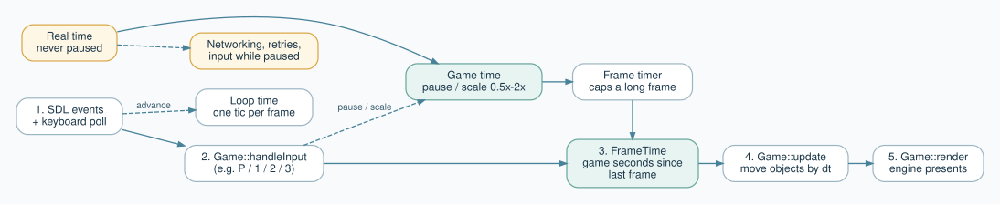
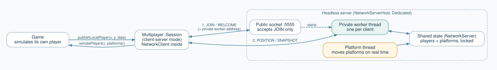
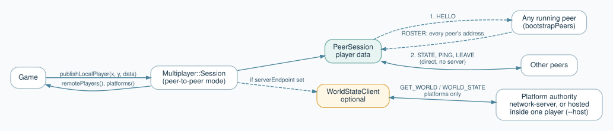

# Shared Engine - Project 2: Time and Networking Foundations

**Team:** Harsha Vardhan Puvvadi, Seojin Kim, Vanaja Agarwal. **CSC 581**. Shared engine features cover all five sections (1 to 5).

A reusable C++17 game engine built on SDL3 (window, input, drawing) and ZeroMQ (networking).
Games supply their own rules and should reach the network only through the engine (a test checks
this boundary). Milestone 1 features (entities, gravity, collision, input, scaling) are not repeated
in detail here; their commonly used APIs are listed below.

Build with a C++17 compiler, CMake 3.16 or newer, Git, and your platform's development tools.
The first setup also downloads Dear ImGui for a development tool. Networking tests need
permission to use local TCP connections.

```bash
git submodule update --init --recursive
cmake -S . -B build && cmake --build build -j 4 && ctest --test-dir build --output-on-failure
```

## What each section asked for and how we did it

| Section | Assignment asks for | What we built | How to see it |
| --- | --- | --- | --- |
| 1 | A time system that can pause, speed up (2x) and slow down (0.5x) | A `Timeline` clock that counts time on top of another clock. The engine keeps three: **real time** (never stops), **game time** (pausable, scalable) and **loop count**. Objects move by "time since last frame" from game time, so pausing or scaling needs no change to them | `./build/timeline-sandbox`; in `network-client` press `P` to pause, `1`/`2`/`3` for 0.5x/1x/2x |
| 2 | A server with no window that keeps at least 3 separate client windows in sync | Each client moves its own player and sends the position to the server; the server replies with everyone's latest positions. Clients can join at any time | `./build/network-server`, then three `./build/network-client` (move with `WASD`) |
| 3 | Game loop split across at least 2 threads, safely | `FrameWorkers` gives a game long-lived worker threads and waits for all of them each frame. Apex runs its platforms on one and its player on the other; the main thread keeps input, collisions and drawing. Entity accessors use locks; parallel tasks must also avoid conflicting access to shared data | `./build/apex-ascent`, `frame-workers-tests` |
| 4 | A server where one slow client does not slow the others, without ZeroMQ's Router/Dealer | The server gives every client its own thread and connection. A slow or paused client only delays its own thread. Moving platforms are run by the server so all clients see them in the same place | `./build/network-server --rates` prints each client's update rate |
| 5 | Peer-to-peer networking | **Hybrid:** players send their positions straight to each other; a server (separate, or hosted inside one player's game) only supplies the moving platforms. Games switch between client-server and peer-to-peer with one setting | `./build/multiplayer-demo --mode peer-to-peer` (add `--host` to host the platforms) |

## Files for this milestone

```text
Section 1 Time
├── include/TimeSource.hpp, TimeUnits.hpp   src/RealTimeClock.cpp    "what time is it" interface, real clock, units
├── include/Timeline.hpp                    src/Timeline.cpp         the pausable, scalable clock
├── include/DeltaTimer.hpp, FrameTime.hpp   src/DeltaTimer.cpp       "time since last frame"
├── include/Engine.hpp                      src/Engine.cpp           owns the three clocks, builds FrameTime each frame
├── sandbox/TimelineSandbox.cpp                                      demo with on-screen controls
└── tests/TimelineTests.cpp
Section 2 Client-server
├── include/NetworkProtocol.hpp             src/NetworkProtocol.cpp  the messages clients and server exchange
├── include/WireFormat.hpp, Endpoint.hpp, ZmqMessage.hpp             message encoding, addresses, ZeroMQ send/receive
├── include/NetworkClient.hpp               src/NetworkClient.cpp    client: join, send position, receive world
├── include/NetworkServer.hpp               src/NetworkServer.cpp    server: who is connected, where everyone is
├── sandbox/NetworkServerMain.cpp, NetworkClientDemo.cpp (+ NetworkDemoConfig.hpp, NetworkDemoPlayer.hpp)
└── tests/NetworkTests.cpp, ZmqSmokeTests.cpp
Section 3 Threads
├── include/Entity.hpp                      src/Entity.cpp           game objects with individually locked accessors
├── include/FrameWorkers.hpp                src/FrameWorkers.cpp     splits a game's update across threads, one per task
├── sandbox/ThreadLoopSandbox.cpp, ThreadExampleMain.cpp             first version of the pattern, standalone
└── tests/FrameWorkersTests.cpp
Section 4 Asynchronous server
├── include/NetworkServerHost.hpp           src/NetworkServerHost.cpp  one thread per client, platform timer
├── include/SendPacer.hpp                   src/SendPacer.cpp        send rate follows game speed (0.5x halves, 2x doubles)
└── tests/NetworkServerHostTests.cpp
Section 5 Peer-to-peer
├── include/PeerProtocol.hpp                src/PeerProtocol.cpp     messages peers exchange
├── include/PeerSession.hpp                 src/PeerSession.cpp      players finding and talking to each other
├── include/WorldStateClient.hpp            src/WorldStateClient.cpp fetches only the moving platforms
├── include/Multiplayer.hpp                 src/Multiplayer.cpp      one simple API over both networking styles
├── sandbox/MultiplayerDemo.cpp
└── tests/PeerTests.cpp, MultiplayerTests.cpp
```

## API reference

Games choose the functions they need and enable worker threads and send pacing themselves.
Windowed games link `engine` and `multiplayer`; headless servers link `network-core`.
Networking, time, geometry, and workers do not need SDL.

### Engine and game hooks (`Engine.hpp`, `Game.hpp`)

| Function | Meaning |
| --- | --- |
| `Engine(title, width, height)` | Create the window and renderer with the game's chosen width and height |
| `Engine::run(game)`, `quit()` | Run the game loop or request that it stop |
| `Game::handleInput(engine)` | Read input after the engine updates the keyboard state |
| `Game::update(const FrameTime&, engine)` | Receive elapsed and total game time; the engine calls this version |
| `Game::update(float deltaTime, engine)` | Required update method using seconds; the default `FrameTime` version calls it |
| `Game::render(renderer)` | Draw after the engine clears the screen and applies scaling |
| `Game::onEvent(event)`, `renderOverlay(renderer)` | Optional methods for handling events and drawing an overlay |
| `getRenderer()`, `getWindow()` | Access SDL objects for drawing, window titles, and UI |
| `getWidth()`, `getHeight()` | Read the game's original width and height, not the resized window size |
| `setClearColor(color)`, `setClearColor(r, g, b)` | Change the background clear color |
| `getScaleMode()`, `setScaleMode(mode)`, `toggleScaleMode()` | Check or change fixed pixel sizing versus scaling to fit without stretching |
| `setScaleToggleKey(key)` | Change the default F1 key, or disable it with `SDL_SCANCODE_UNKNOWN` |

### Time (`Timeline.hpp`, `DeltaTimer.hpp`, `FrameTime.hpp`)

| Function | Parameter | Type | Meaning |
| --- | --- | --- | --- |
| `Timeline(anchor, ticSize)` | `anchor` | clock | The clock this one follows: real time or another timeline |
| | `ticSize` | integer | How many of the anchor's ticks make one of ours. Bigger = slower. Must be > 0 |
| `setScale(scale)` | `scale` | decimal | Speed multiplier: `0.5` half speed, `1.0` normal, `2.0` double |
| `pause()`, `unpause()`, `togglePause()` | none | none | Stop / resume the clock. Its reading never jumps backwards |
| `DeltaTimer(source, maxDelta)` | `maxDelta` | integer | Longest gap one frame may report, so a freeze does not teleport objects |
| `FrameTime` (given each frame) | `dtSeconds` | decimal | Game seconds since the last frame (0 while paused) |
| | `gameTimeUs` | integer | Total game time so far, in microseconds |
| `now()` | none | integer result | Read a timeline's current tic count |
| `setTicSize(size)`, `ticSize()` | `size` | integer | Set or read how many anchor tics make one timeline tic |
| `scale()`, `isPaused()` | none | decimal / boolean result | Check timeline speed and whether it is paused |
| `DeltaTimer::tick()`, `reset()` | none | integer result / no result | Measure elapsed tics or restart a separate timer's measurement |
| `setMaxDelta(value)`, `maxDelta()`, `lastWasClamped()` | `value` | integer | Set or check the maximum elapsed time per update, and whether it was limited |

`engine.realTime()` counts nanoseconds, `engine.gameTime()` counts game microseconds, and
`engine.loopTime()` counts iterations, all using signed `std::int64_t` values. Counting loops
does not set FPS. The engine already ticks `engine.frameTimer()` each frame. Use its supplied
delta without scaling it again. Frame deltas are limited after long delays; total `gameTimeUs`
is not. Keep clocks alive while timelines or sessions use them.

### Frame workers (`FrameWorkers.hpp`)

| Function | Meaning |
| --- | --- |
| `FrameWorkers(tasks)` | Start one thread per task and reuse it each frame |
| `runFrame(deltaTime)` | Run every task once with the same game-time delta and wait for all to finish |
| `workerCount()`, `framesRun()` | Read the worker count and number of completed frames |
| Destructor | Stop the workers and wait for their threads to finish |

Split at least two update tasks between workers, using unchanged inputs and separate results.
Apply shared changes after `runFrame()` finishes. Entity locks protect individual calls, not
sequences of calls. Keep SDL input, rendering, and `Engine::run()` on the main thread. Declare
workers last so they finish before other game members are destroyed. Task exceptions reach
the thread calling `runFrame()`.

### Multiplayer (`Multiplayer.hpp`): what a game uses

A game fills in a `Config`, calls `Session::open(config, engine.realTime(), &engine.gameTime())`, then every frame calls
`update()` and `publishLocalPlayer(x, y, data)` and reads `remotePlayers()` and `platforms()`.
Connection failures show up in state/status; invalid pacing configuration can throw an exception.

| Function | Meaning |
| --- | --- |
| `Session::open(config, realTime, gameTime)` | Start either mode; pass the game clock when send pacing is enabled |
| `update()` | Receive updates and handle reconnecting, even while paused |
| `publishLocalPlayer(x, y, data)` | Submit the latest local position and data, even when standing still or paused |
| `localPlayerId()` | Read this player's ID once ready |
| `remotePlayers()` | Read other players' IDs, names, positions, and data, excluding the local player |
| `platforms()` | Read server-controlled platform IDs, positions, and sizes |
| `state()`, `status()` | Read `Connecting`, `Ready`, or `Failed`, and an explanation |
| `authorityState()` | Check the platform server: `NotConfigured`, `Connecting`, `Ready`, or `Failed` |
| `mode()`, `Multiplayer::modeName(mode)`, `Multiplayer::parseMode(text, mode)` | Read the mode or convert between its name and value |
| `leave()` | Tell others this player is leaving, then destroy/reset the session rather than read old state |

Call session functions on the main thread; give workers copies of received data. In peer mode,
`Ready` does not guarantee connected peers or a platform server. Platforms keep their last
positions after server loss; check `authorityState()` before treating them as current.

| `Config` setting | Default | Meaning |
| --- | --- | --- |
| `mode` | `ClientServer` | `ClientServer` (everyone talks to a server) or `PeerToPeer` (players talk directly) |
| `serverEndpoint` | `tcp://127.0.0.1:5555` | Server address. In peer-to-peer, where platforms come from (empty = no platforms) |
| `playerName` | empty | Name other players see |
| `sendIntervalGameTics` | `0` | Game time between position send opportunities (microseconds with the engine clock). `0` = no pacing. Set it to target half the rate at 0.5x and double at 2x |
| `heartbeatIntervalRealTics` | `250'000'000` ns (250 ms) | Real time between fallback send opportunities while paused, so a paused player isn't timed out. Only used when pacing is on |
| `peerId` | `1` | Peer-to-peer only: this player's number; each player needs a different one |
| `basePort` | `7100` | Peer-to-peer only: this player uses this port and the next one |
| `advertiseHost` | `127.0.0.1` | Peer-to-peer only: this computer's address as others should dial it (LAN IP across machines) |
| `bootstrapPeers` | none | Peer-to-peer only: the address of any player already in the game |

`publishLocalPlayer(x, y, data)`: `x`, `y` are the player's position; `data` is optional extra
text the game wants to share (for example, health or score), up to 512 bytes. The engine passes it along unread.
The game chooses the data format and checks received values.

For pacing, include `TimeUnits.hpp`, set `config.sendIntervalGameTics = kGameTicsPerSecond / 30`,
and pass `&engine.gameTime()` to `Session::open()`. This targets 15/30/60 position messages per
real second at 0.5x/1x/2x, and about four heartbeat messages per second while paused. It changes the
message rate, not FPS. Low FPS or slow replies can reduce the actual rate. While waiting for a
reply, a client skips new submissions rather than building a queue of old positions.

In hybrid mode, `HELLO`/`ROSTER` help peers find each other. `STATE` sends player updates,
`PING` says a peer is still connected, and `LEAVE` announces departure. `WorldStateClient`
uses `GET_WORLD` for platforms only, without registering a server-side player. This is the
hybrid option, not the server-free extra-credit design. Across laptops, advertise each one's
LAN address and make both peer ports reachable from every other laptop.

### Running a server (`NetworkServer.hpp`, `NetworkServerHost.hpp`)

Create `NetworkServerHost(serverConfig, hostConfig)`, then call `start()` and later `stop()`.

| Function | Meaning |
| --- | --- |
| `start()` | Open the listening socket and start serving; throw an exception if startup fails |
| `stop()` | Stop serving and wait for all threads to finish; safe to call more than once |
| `running()`, `boundEndpoint()` | Check whether the host is running and which address it listens on |
| `playerCount()`, `activeWorkers()` | Count connected players and dedicated workers |
| `traffic()` | Read each player's `acceptedPositions` count; compare readings to measure accepted updates per second |

The host handles sockets, connection addresses, worker threads, platform updates, and shutdown.
Games supply settings instead of writing that networking code again. Dedicated mode gives each
client a thread for Section 4; listen mode uses one REP socket to serve shared platforms.
Across laptops, clients must reach both the public server port and its worker ports.

| Setting | Default | Meaning |
| --- | --- | --- |
| `ServerConfig.spawnPoints` | none | Where new players appear (`x`, `y`) |
| `ServerConfig.platforms` | none | Moving platforms: start and end point, `speed` (80 units/s), `width` (96), `height` (20) |
| `ServerConfig.maxPlayers` | `8` | Most players allowed at once |
| `ServerConfig.inactivityTimeoutTics` | 3 seconds | A player silent this long is removed |
| `HostConfig.mode` | `Dedicated` | `Dedicated`: one thread per client (Section 4). `Listen`: one simple connection, for serving platforms |
| `HostConfig.bindEndpoint` | `tcp://*:5555` | Address and port the server listens on |
| `HostConfig.advertiseHost` | `127.0.0.1` | This machine's address as clients should reach it |
| `HostConfig.tickInterval` | 16 ms | How often platforms move |
| `HostConfig.trafficLogInterval` | off | If set, reports accepted POSITION/s through the `log` callback |
| `HostConfig.log` | empty | Optional logging function called by host threads; protect any output shared between threads |
| `HostConfig.pollInterval` | 200 ms | How long workers wait for messages before checking whether to stop |
| `HostConfig.workerStartTimeout` | 2 s | How long to wait for a new worker to open its listening socket |

### Client-server messages (`NetworkProtocol.hpp`): one reply per request

| Client sends | With | Reply | With |
| --- | --- | --- | --- |
| `JOIN` | session token, name | `WELCOME` | player id, private connection address, world state |
| `POSITION` | id, token, counter, `x`, `y`, `data` | `SNAPSHOT` | every player's position and every platform's |
| `LEAVE` | id, token | `GOODBYE` | none |
| `GET_WORLD` | none (peer-to-peer) | `WORLD_STATE` | platform positions only |
| any invalid request | none | `ERROR` | reason |

Tokens link requests to sessions. Sequence numbers stop old positions from replacing newer ones.
Neither encrypts messages nor checks whether a player's movement is physically possible.

### Other shared APIs used by games (`Entity.hpp`, `Physics.hpp`, `Collision.hpp`, `Input.hpp`)

| API | Meaning |
| --- | --- |
| `Entity(x, y, width, height)`, `setPosition()`, `setSize()`, `getX()`, `getY()`, `getBounds()` | Store and read an object's position and size |
| `setVelocity()`, `setVelocityX()`, `setVelocityY()`, `getVelocityX()`, `getVelocityY()` | Set or read entity velocity |
| `Entity::update(float)`, `Entity::update(const FrameTime&)` | Move using velocity and elapsed game time |
| `Physics::setGravity()`, `getGravity()`, `applyGravity(entity, deltaTime)` | Set gravity and apply it to chosen entities; set it before starting workers |
| `Collision::intersects()`, `getIntersection()`, `getSeparation()`, `resolve()` | Check rectangle overlaps and optionally separate them; the game decides what happens next |
| `Entity::collidesWith()`, `containsPoint()` | Check for an overlapping entity or a point inside the bounds |
| `Input::isKeyPressed()`, `isKeyJustPressed()`, `isKeyJustReleased()` | Check held, newly pressed, or newly released keys |
| `Input::getAxis()`, `isAnyKeyPressed()` | Read direction keys or check a group of keys; the engine calls `Input::update()` each frame |

## Design decisions

- **Two kinds of time.** Movement uses game time; networking, input and drawing use real time,
  so a paused client still hears the "unpause" key and stays connected.
- **One thread per client.** A basic ZeroMQ request/reply connection handles one request at a
  time, so the public address only admits new players and gives each a private connection.
- **Games own their rules.** Clients simulate their own characters; the server stores their reports
  and updates shared platforms. Each game supplies the controls, collision responses, and other rules.

<div style="page-break-before: always"></div>

## Appendix: how the pieces fit

Networking internals are covered in more depth in [docs/networking-guide.md](docs/networking-guide.md).

**A. One frame and the clocks behind it (Section 1).** Each frame runs steps 1 to 5. Movement uses game
time, which the game can pause or scale; networking keeps running on real time.



**B. Client-server (Section 2, Section 4).** A new client joins through the public socket and is handed its own
worker thread; after that it only talks to that worker. The server moves platforms on its own.



**C. Peer-to-peer, hybrid (Section 5).** A new peer asks any running peer for the list of players, then
sends its position straight to them. Platforms optionally come from a server.



<sub>LLM assistants were used to help navigate the code structure and draft docs; the team reviewed all design and code.</sub>
