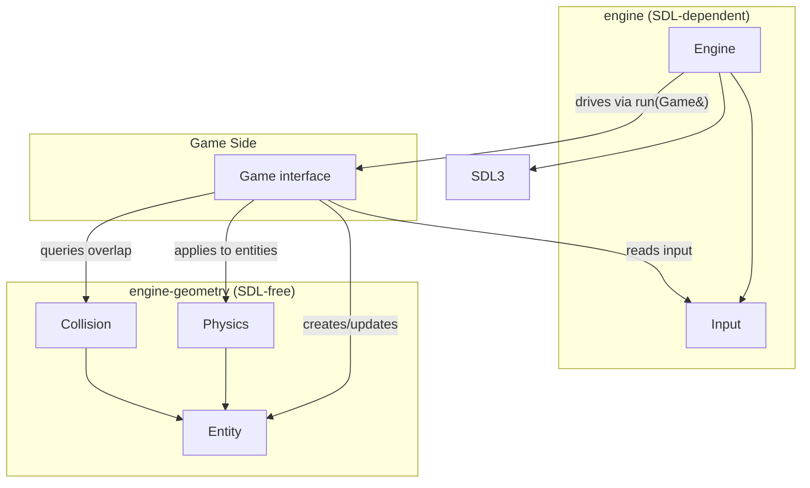
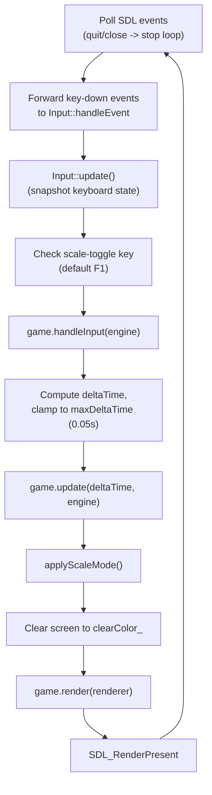
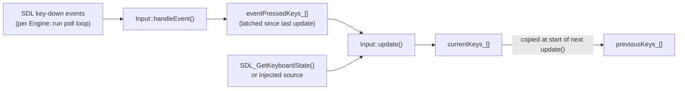

# Engine Reference

A single consolidated reference for the shared engine: the reusable
C++17/SDL3 code in `include/` and `src/`.

Contents:

- Overview & Architecture
- Engine & Game
- Entity
- Physics
- Input
- Collision

## Overview & Architecture

This is a reference for the shared engine itself: the reusable C++17/SDL3
code in `include/` and `src/`. It intentionally does not cover any specific
game built on top of the engine (those live under `individual-games/<name>/`).

### What the engine is

The engine is a small foundation for building 2D games with SDL3. It is
split into two CMake libraries (see `CMakeLists.txt`):

- **`engine-geometry`** — SDL-free: `Entity`, `Physics`, `Collision`. Pure
  geometry and math, so it needs no window or renderer.
- **`engine`** — SDL-dependent: `Engine`, `Input`. Publicly links
  `engine-geometry` and `SDL3::SDL3`, so any game that links `engine` gets
  everything transitively.

| Target | Sources | Depends on |
| --- | --- | --- |
| `engine-geometry` | `Entity`, `Physics`, `Collision` | none (SDL-free) |
| `engine` | `Engine`, `Input` | `SDL3`, `engine-geometry` |

Games and anything that needs a window link `engine` once and get geometry
transitively. Code that needs only geometry can link `engine-geometry`
alone.

A game does not subclass or modify the engine. Instead it implements the
`Game` interface and hands an instance to `Engine::run()`. The engine owns
the window, renderer, main loop, and timing; it knows nothing about players,
enemies, or scores.

### Subsystems

| System | Files | Covers |
| --- | --- | --- |
| Engine & Game | `Engine.hpp`, `Engine.cpp`, `Game.hpp` | Window/renderer setup, main loop, timing, render scaling, the game extension point |
| Entity | `Entity.hpp`, `Entity.cpp` | Position, size, velocity, bounding rectangle |
| Physics | `Physics.hpp`, `Physics.cpp` | Configurable gravity |
| Input | `Input.hpp`, `Input.cpp` | Keyboard state, edge detection, multi-key queries |
| Collision | `Collision.hpp`, `Collision.cpp` | AABB overlap, intersection region, separation, resolution |

See the "Engine & Game", "Entity", "Physics", "Input", and "Collision"
sections below for the detailed per-system material.

### Architecture



`Engine` never references `Entity`, `Physics`, or `Collision` directly — it
only knows about `Game` and SDL. Everything below the `Game` line in the
diagram is code a game chooses to use; the engine does not require it.

### Per-frame lifecycle

`Engine::run(Game& game)` in `Engine.cpp` drives one iteration of this
sequence every frame, until the window is closed or `Engine::quit()` is
called:



This is the exact loop body from `Engine::run()`:

```cpp
void Engine::run(Game& game)
{
    Uint64 previousFrameTime = SDL_GetTicks();

    while (isRunning_) {
        // The engine only acts on window-close events itself; key events are
        // handed to Input so a key tapped between frames still registers, and
        // all gameplay input is read through the polling Input system.
        SDL_Event event;
        while (SDL_PollEvent(&event)) {
            if (event.type == SDL_EVENT_QUIT ||
                event.type == SDL_EVENT_WINDOW_CLOSE_REQUESTED) {
                isRunning_ = false;
            }

            Input::handleEvent(event);
        }

        Input::update();

        if (scaleToggleKey_ != SDL_SCANCODE_UNKNOWN && Input::isKeyJustPressed(scaleToggleKey_)) {
            toggleScaleMode();
        }

        game.handleInput(*this);

        const Uint64 currentFrameTime = SDL_GetTicks();
        float deltaTime = static_cast<float>(currentFrameTime - previousFrameTime) / 1000.0F;
        previousFrameTime = currentFrameTime;

        // Keep physics stable if the window stalls for a moment.
        if (deltaTime > maxDeltaTime) {
            deltaTime = maxDeltaTime;
        }

        game.update(deltaTime, *this);

        applyScaleMode();
        SDL_SetRenderDrawColor(renderer_, clearColor_.red, clearColor_.green, clearColor_.blue, 255);
        SDL_RenderClear(renderer_);
        game.render(renderer_);
        SDL_RenderPresent(renderer_);
    }
}
```

Notes on the ordering:

- Window-close/quit events are handled by `Engine` itself; every other key
  event is forwarded to `Input::handleEvent()` so a key tapped and released
  within a single frame is still latched for that frame. See the Input
  section for why both a polling and an event path exist.
- `Input::update()` runs before the scale-toggle check and before
  `game.handleInput()`, so both the engine's own `F1` handling and the
  game's input logic see the same up-to-date key state.
- `deltaTime` is computed from `SDL_GetTicks()` deltas and clamped to
  `maxDeltaTime = 0.05F` seconds, so a stalled frame (e.g. the window was
  dragged) cannot make physics or movement jump forward unrealistically.
- `applyScaleMode()` runs every frame (not just on resize or toggle) because
  it also resets the SDL render scale to `1.0` before deciding whether to
  apply logical letterboxing.
- The renderer is cleared to `clearColor_` before `game.render()` is called,
  and presented immediately after it returns; a game's `render()` only needs
  to draw, never to clear or present.

### Build commands

From the repository root:

```bash
cmake -S . -B build
cmake --build build
```

## Engine & Game

`Engine.hpp`/`Engine.cpp` — window, renderer, main loop, timing, and render
scaling.

`Game.hpp` — the interface a game implements to plug into the engine.

See the Overview & Architecture section for the overall architecture and
the full per-frame lifecycle diagram; this section covers the API surface in
detail, with the real implementation code for every method.

### Using it from a game

A game subclasses `Game`, constructs an `Engine`, and hands the game to
`Engine::run()`:

```cpp
#include "Engine.hpp"
#include "Game.hpp"
#include "Input.hpp"

#include <SDL3/SDL.h>
#include <iostream>

class MyGame : public Game {
public:
    void handleInput(Engine& engine) override
    {
        if (Input::isKeyJustPressed(SDL_SCANCODE_ESCAPE)) {
            engine.quit();
        }
    }

    void update(float /*deltaTime*/, Engine& /*engine*/) override
    {
        // gravity -> entity.update -> collision
    }

    void render(SDL_Renderer* renderer) const override
    {
        // draw with SDL_Render* using design-resolution coordinates
        (void)renderer;
    }
};

int main()
{
    try {
        Engine engine("My Game", 800, 600);
        engine.setClearColor(30, 60, 140);

        MyGame game;
        engine.run(game);
        return 0;
    } catch (const std::exception& error) {
        std::cerr << "Engine failed to start: " << error.what() << '\n';
        return 1;
    }
}
```

Because both constructor failure paths throw `std::runtime_error`,
construction belongs inside a `try`/`catch` in `main()`.

Build side: wire the executable in `CMakeLists.txt` and link the `engine`
target, which also puts `include/` on the include path:

```cmake
add_executable(my-game individual-games/<name>/myGame.cpp)
target_link_libraries(my-game PRIVATE engine)
```

### `Engine`

`Engine` holds no game state of its own. It owns SDL setup and the frame
loop, and drives whatever `Game` is passed to `run()`.

#### Construction and destruction

```cpp
Engine::Engine(const char* title, int width, int height)
    : width_(width),
      height_(height)
{
    if (!SDL_Init(SDL_INIT_VIDEO)) {
        throw std::runtime_error(std::string("Failed to initialize SDL: ") + SDL_GetError());
    }

    if (!SDL_CreateWindowAndRenderer(
            title,
            width_,
            height_,
            SDL_WINDOW_RESIZABLE,
            &window_,
            &renderer_)) {
        SDL_Quit();
        throw std::runtime_error(std::string("Failed to create SDL window and renderer: ") + SDL_GetError());
    }

    applyScaleMode();
}

Engine::~Engine()
{
    SDL_DestroyRenderer(renderer_);
    SDL_DestroyWindow(window_);
    SDL_Quit();
}
```

- `width`/`height` are the **design resolution** — the coordinate space a
  game lays its entities out in. They are not necessarily the final pixel
  size of the window (see Scale modes below).
- `SDL_Init(SDL_INIT_VIDEO)` is called first; on failure, a
  `std::runtime_error` is thrown carrying `SDL_GetError()`'s message.
- `SDL_CreateWindowAndRenderer(title, width_, height_, SDL_WINDOW_RESIZABLE, &window_, &renderer_)`
  creates an always-resizable window and its renderer together. If this
  fails, `SDL_Quit()` runs first (so the earlier successful `SDL_Init` does
  not leak) before throwing.
- The constructor finishes by calling the private `applyScaleMode()` once,
  so the renderer's logical presentation matches the default scale mode
  (`ScaleMode::Proportional`) before the first frame is drawn.
- The destructor destroys the renderer, then the window, then calls
  `SDL_Quit()` — the reverse of construction order.

```cpp
Engine(const Engine&) = delete;
Engine& operator=(const Engine&) = delete;
Engine(Engine&&) = delete;
Engine& operator=(Engine&&) = delete;
```

`Engine` is non-copyable and non-movable — all four special member
functions are explicitly deleted, since it owns raw SDL handles
(`window_`, `renderer_`) with no reference-counting.

The `SDL_Quit()` on the window/renderer failure path matters because the
destructor never runs for an object whose constructor threw — that call is
the only thing preventing a failed startup from leaving SDL initialized.

Since the destructor runs exactly once per successfully constructed engine
(the type is non-copyable and non-movable), games must draw with
`getRenderer()` or the `SDL_Renderer*` handed to `Game::render`, and must
never create a second renderer or call `SDL_Quit()` themselves while an
`Engine` is alive.

#### Running the game

```cpp
void quit()
{
    isRunning_ = false;
}
```

- `run()` (shown in full in the Overview & Architecture lifecycle section)
  blocks,
  executing the frame loop until the loop's `isRunning_` flag becomes
  `false`.
- `isRunning_` is set to `false` when SDL reports `SDL_EVENT_QUIT` or
  `SDL_EVENT_WINDOW_CLOSE_REQUESTED`, or when a game calls `engine.quit()`
  (e.g. from `handleInput` or `update`). `quit()` only flips the flag; the
  current frame still finishes (input, update, render, present) before the
  loop exits.
- Every other SDL event polled during the frame is forwarded to
  `Input::handleEvent(event)` — see the Input section for how that is used.
- Frame timing: `deltaTime` is
  `(currentFrameTime - previousFrameTime) / 1000.0F` seconds, using
  `SDL_GetTicks()` (millisecond resolution), then clamped:

  ```cpp
  static constexpr float maxDeltaTime = 0.05F;
  if (deltaTime > maxDeltaTime) {
      deltaTime = maxDeltaTime;
  }
  ```

  This caps the simulation step at 50ms (20 FPS equivalent) so a stall
  (window drag, breakpoint, OS scheduling hiccup) does not cause a large
  physics/movement jump on the next frame. There is no minimum clamp or
  fixed-timestep accumulator — the engine uses a variable timestep every
  frame.
- Call order inside the loop body, once events are drained: the built-in
  scale-toggle check, then `game.handleInput(*this)`, then delta-time
  computation, then `game.update(deltaTime, *this)`, then
  `applyScaleMode()`, then clear/render/present. `Input::update()` runs
  once per frame, before the scale-toggle check and before
  `game.handleInput()`.

The frame timestamp is read *after* `game.handleInput()` rather than at the
top of the loop, so the measured interval covers the presented frame's own
work. `previousFrameTime` advances to the raw timestamp even when the
computed delta is later clamped, so time never accumulates a debt.

Draining the whole event queue is required even though the engine itself
acts only on quit and window-close: that drain is what lets SDL refresh the
keyboard array `SDL_GetKeyboardState()` reads from. All gameplay input then
comes from the polling `Input` API — games never inspect `SDL_Event` for
keys themselves.

The built-in scale-toggle check runs before `handleInput`, so a game reading
the same key sees the mode that is already in effect for the frame.

The delta-time clamp is a soft guard against a stalled frame teleporting a
fast mover through a thin wall; it is not continuous collision detection.

#### Renderer and design-resolution accessors

```cpp
SDL_Renderer* Engine::getRenderer() const
{
    return renderer_;
}

int Engine::getWidth() const
{
    return width_;
}

int Engine::getHeight() const
{
    return height_;
}
```

- `getRenderer()` is the only supported way for a game to obtain the
  renderer for drawing; games should not create their own renderer.
- `getWidth()`/`getHeight()` return the design resolution passed to the
  constructor (constant for the lifetime of the `Engine`), not the current
  window pixel size. Games position entities in this coordinate space
  regardless of the current scale mode.

#### Clear color

```cpp
struct Color {
    std::uint8_t red;
    std::uint8_t green;
    std::uint8_t blue;
};
static constexpr Color defaultClearColor{30, 60, 140};
```

```cpp
void Engine::setClearColor(Color color)
{
    clearColor_ = color;
}

void Engine::setClearColor(std::uint8_t red, std::uint8_t green, std::uint8_t blue)
{
    clearColor_ = Color{red, green, blue};
}
```

- The screen is cleared to `clearColor_` at the start of every frame's
  render step, before `game.render()` runs:

  ```cpp
  SDL_SetRenderDrawColor(renderer_, clearColor_.red, clearColor_.green, clearColor_.blue, 255);
  SDL_RenderClear(renderer_);
  ```

  Alpha is always `255`.
- The default is a blue (`{30, 60, 140}`), assigned as the member
  initializer for `clearColor_`; a game may call `setClearColor` at any
  time (e.g. from `update()`) to change it, and the new color takes effect
  starting with that same frame's clear.

#### Scale modes

```cpp
enum class ScaleMode {
    Constant,
    Proportional,
};
```

```cpp
Engine::ScaleMode Engine::getScaleMode() const
{
    return scaleMode_;
}

void Engine::setScaleMode(ScaleMode mode)
{
    scaleMode_ = mode;
}

void Engine::toggleScaleMode()
{
    scaleMode_ = (scaleMode_ == ScaleMode::Constant) ? ScaleMode::Proportional : ScaleMode::Constant;
}

void Engine::setScaleToggleKey(SDL_Scancode key)
{
    scaleToggleKey_ = key;
}
```

Games always draw in design-resolution coordinates (`getWidth()` x
`getHeight()`). `applyScaleMode()` (private, called once from the
constructor and once per frame from `run()`) is the single place that
decides how those coordinates map onto actual window pixels:

```cpp
// Games always draw in design-resolution coordinates; this is the one place
// that decides how those coordinates become pixels.
void Engine::applyScaleMode()
{
    SDL_SetRenderScale(renderer_, 1.0F, 1.0F);

    if (scaleMode_ == ScaleMode::Constant) {
        SDL_SetRenderLogicalPresentation(
            renderer_, 0, 0, SDL_LOGICAL_PRESENTATION_DISABLED);
        return;
    }

    SDL_SetRenderLogicalPresentation(
        renderer_, width_, height_, SDL_LOGICAL_PRESENTATION_LETTERBOX);
}
```

- **`ScaleMode::Constant`** — one design unit equals one output pixel,
  regardless of window size. Logical presentation is disabled
  (`SDL_LOGICAL_PRESENTATION_DISABLED`). Resizing the window reveals more
  or less of the game world rather than scaling it.
- **`ScaleMode::Proportional`** (the default, `scaleMode_ = ScaleMode::Proportional`) —
  SDL's logical presentation uniformly scales the design resolution to fit
  the window using `SDL_LOGICAL_PRESENTATION_LETTERBOX`, preserving the
  design aspect ratio. Unused space appears as letterbox bars rather than
  stretching the image or scaling axes independently.
- `setScaleMode()` sets the mode directly; `toggleScaleMode()` flips between
  the two. Both take effect on the next call to `applyScaleMode()` (i.e.
  the next frame, or immediately if called before the first frame).
- `scaleToggleKey_` defaults to `SDL_SCANCODE_F1`. Each frame, if the key is
  not `SDL_SCANCODE_UNKNOWN` and `Input::isKeyJustPressed(scaleToggleKey_)`
  is true, `run()` calls `toggleScaleMode()` itself — a game does not need
  to wire this up. `setScaleToggleKey(SDL_SCANCODE_UNKNOWN)` disables the
  built-in toggle entirely (e.g. if a game wants to bind its own key or
  no key at all); any other scancode rebinds it.

| Mode | Behavior |
| --- | --- |
| `Constant` | `SDL_LOGICAL_PRESENTATION_DISABLED`. One design unit maps to one screen pixel. Resizing reveals more or less of the world. |
| `Proportional` (default) | Logical presentation with `SDL_LOGICAL_PRESENTATION_LETTERBOX` at the design width/height. Uniform scale; unused space is letterboxed. |

`applyScaleMode()` resets render scale to `(1, 1)` first so the two
mechanisms can never compound — whatever a previous mode or a game left
behind is wiped before the new presentation is set. It is re-applied every
frame precisely so that a window resize is picked up. **Do not** introduce
independent horizontal and vertical scaling for `Proportional`: that breaks
aspect preservation.

`getScaleMode()`, `setScaleMode()`, and `toggleScaleMode()` only touch the
field and never talk to SDL, so a mode change takes effect on the next
presented frame no matter who made it.

#### Private state

```cpp
private:
    static constexpr float maxDeltaTime = 0.05F;

    void applyScaleMode();

    SDL_Window* window_ = nullptr;
    SDL_Renderer* renderer_ = nullptr;

    int width_;
    int height_;

    Color clearColor_ = defaultClearColor;

    ScaleMode scaleMode_ = ScaleMode::Proportional;
    SDL_Scancode scaleToggleKey_ = SDL_SCANCODE_F1;

All state is private; games reach it only through the public functions
above.

| Variable | Type | Purpose |
| --- | --- | --- |
| `maxDeltaTime` | `static constexpr float` (= `0.05F`) | Upper bound on a frame's delta time, in seconds. |
| `defaultClearColor` | `static constexpr Color` (= `{30, 60, 140}`) | Clear colour a new engine starts with. |
| `window_` | `SDL_Window*` | The window, destroyed by the destructor. |
| `renderer_` | `SDL_Renderer*` | The one renderer; handed to `Game::render` each frame. |
| `width_`, `height_` | `int` | Design resolution, fixed at construction. |
| `clearColor_` | `Color` | Colour the loop clears to each frame. |
| `scaleMode_` | `ScaleMode` | Current mapping from design units to pixels; `Proportional` by default. |
| `scaleToggleKey_` | `SDL_Scancode` | Built-in toggle key; `SDL_SCANCODE_UNKNOWN` disables it. Defaults to F1. |
| `isRunning_` | `bool` | Loop condition; cleared by `quit()` or a close event. |

    bool isRunning_ = true;
```

### `Game`

```cpp
class Game {
public:
    virtual ~Game() = default;

    // Called once per frame, after Input::update(), before update().
    virtual void handleInput(Engine& engine) = 0;

    // Advance the simulation. deltaTime is in seconds and already clamped.
    virtual void update(float deltaTime, Engine& engine) = 0;

    // Draw the frame. The engine has already cleared the screen and applied the
    // current scaling mode, and presents once this returns.
    virtual void render(SDL_Renderer* renderer) const = 0;
};
```

`Game` is the engine's only extension point. A specific game subclasses it
and passes an instance to `Engine::run()`. `Engine` calls exactly one of
each method per frame, always in this order, per the frame loop in
`Engine.cpp`:

1. **`handleInput(Engine& engine)`** — called after `Input::update()` has
   already run for the frame, so any `Input::isKeyPressed`/
   `isKeyJustPressed`/etc. query reflects this frame's state. Typically
   reads input and updates entity velocities/state, and may call
   `engine.setScaleMode()`/`quit()`/etc.
2. **`update(float deltaTime, Engine& engine)`** — called with the frame's
   clamped delta time. Typically advances entities (`Entity::update`),
   applies physics (`Physics::applyGravity`), and resolves collisions
   (`Collision::resolve`/`intersects`).
3. **`render(SDL_Renderer* renderer) const`** — called after the engine has
   already cleared the screen to the clear color and applied the current
   scale mode for this frame. The engine calls `SDL_RenderPresent` itself
   immediately after this returns, so `render()` should only draw — it must
   not clear or present. It is `const`, so it should not mutate game state.

`Game` has a virtual destructor and no other state or behavior; the engine
does not require a game to store a reference to the `Engine` beyond what is
passed into each call.

Summarized as a contract:

| Method | When | Responsibility |
| --- | --- | --- |
| `handleInput` | After `Input::update()`, before `update` | Read keys via `Input::...`, set intent (velocity, jump flags, quit). |
| `update` | After delta time is computed and clamped | Advance simulation: gravity, `Entity::update`, collision, camera. |
| `render` | After clear and scale apply | Draw the frame. The engine presents when this returns. |

`deltaTime` is in **seconds** and already clamped by the loop; games should
not re-clamp it unless they have a specific reason.

A typical per-frame order inside a game's own code, which the engine does
not enforce:

```text
input -> gravity (selected entities) -> entity update -> collision -> render
```

### Reference

Complete, verbatim source of the files covered in this section.

#### `include/Engine.hpp`

```cpp
#pragma once

#include <SDL3/SDL_scancode.h>

#include <cstdint>

struct SDL_Renderer;
struct SDL_Window;
class Game;

// Core of the engine: window creation, the renderer, the main loop and the
// rendering scale mode. It holds no game state of its own -- the game it drives
// is supplied to run() as a Game.
class Engine {
public:
    // An RGB colour, used for the screen clear.
    struct Color {
        std::uint8_t red;
        std::uint8_t green;
        std::uint8_t blue;
    };

    // Task 1 asks the loop to clear to blue; a game may pick its own.
    static constexpr Color defaultClearColor{30, 60, 140};

    // How entity coordinates and sizes are mapped onto the window.
    enum class ScaleMode {
        // Pixel-based: one design unit is one pixel, whatever the window size.
        // Resizing the window reveals more (or less) of the world.
        Constant,
        // Aspect-preserving: the design resolution is uniformly scaled to
        // fit the window, with letterboxing where its aspect ratio differs.
        Proportional,
    };

    // width/height are the design resolution the game lays its world out in.
    Engine(const char* title, int width, int height);
    ~Engine();

    Engine(const Engine&) = delete;
    Engine& operator=(const Engine&) = delete;
    Engine(Engine&&) = delete;
    Engine& operator=(Engine&&) = delete;

    // Runs the main loop until the window is closed or quit() is called.
    void run(Game& game);

    // Stop the loop at the end of the current frame.
    void quit();

    SDL_Renderer* getRenderer() const;

    // Design resolution the game positions its entities in.
    int getWidth() const;
    int getHeight() const;

    // Colour the screen is cleared to each frame.
    void setClearColor(Color color);
    void setClearColor(std::uint8_t red, std::uint8_t green, std::uint8_t blue);

    ScaleMode getScaleMode() const;
    void setScaleMode(ScaleMode mode);
    void toggleScaleMode();

    // Key that flips between the two scaling modes. Defaults to F1; a game can
    // move it, or disable the built-in toggle with SDL_SCANCODE_UNKNOWN.
    void setScaleToggleKey(SDL_Scancode key);

private:
    static constexpr float maxDeltaTime = 0.05F;

    void applyScaleMode();

    SDL_Window* window_ = nullptr;
    SDL_Renderer* renderer_ = nullptr;

    int width_;
    int height_;

    Color clearColor_ = defaultClearColor;

    ScaleMode scaleMode_ = ScaleMode::Proportional;
    SDL_Scancode scaleToggleKey_ = SDL_SCANCODE_F1;

    bool isRunning_ = true;
};
```

#### `src/Engine.cpp`

```cpp
#include "Engine.hpp"

#include "Game.hpp"
#include "Input.hpp"

#include <SDL3/SDL.h>

#include <stdexcept>
#include <string>

Engine::Engine(const char* title, int width, int height)
    : width_(width),
      height_(height)
{
    if (!SDL_Init(SDL_INIT_VIDEO)) {
        throw std::runtime_error(std::string("Failed to initialize SDL: ") + SDL_GetError());
    }

    if (!SDL_CreateWindowAndRenderer(
            title,
            width_,
            height_,
            SDL_WINDOW_RESIZABLE,
            &window_,
            &renderer_)) {
        SDL_Quit();
        throw std::runtime_error(std::string("Failed to create SDL window and renderer: ") + SDL_GetError());
    }

    applyScaleMode();
}

Engine::~Engine()
{
    SDL_DestroyRenderer(renderer_);
    SDL_DestroyWindow(window_);
    SDL_Quit();
}

void Engine::run(Game& game)
{
    Uint64 previousFrameTime = SDL_GetTicks();

    while (isRunning_) {
        // The engine only acts on window-close events itself; key events are
        // handed to Input so a key tapped between frames still registers, and
        // all gameplay input is read through the polling Input system.
        SDL_Event event;
        while (SDL_PollEvent(&event)) {
            if (event.type == SDL_EVENT_QUIT ||
                event.type == SDL_EVENT_WINDOW_CLOSE_REQUESTED) {
                isRunning_ = false;
            }

            Input::handleEvent(event);
        }

        Input::update();

        if (scaleToggleKey_ != SDL_SCANCODE_UNKNOWN && Input::isKeyJustPressed(scaleToggleKey_)) {
            toggleScaleMode();
        }

        game.handleInput(*this);

        const Uint64 currentFrameTime = SDL_GetTicks();
        float deltaTime = static_cast<float>(currentFrameTime - previousFrameTime) / 1000.0F;
        previousFrameTime = currentFrameTime;

        // Keep physics stable if the window stalls for a moment.
        if (deltaTime > maxDeltaTime) {
            deltaTime = maxDeltaTime;
        }

        game.update(deltaTime, *this);

        applyScaleMode();
        SDL_SetRenderDrawColor(renderer_, clearColor_.red, clearColor_.green, clearColor_.blue, 255);
        SDL_RenderClear(renderer_);
        game.render(renderer_);
        SDL_RenderPresent(renderer_);
    }
}

void Engine::quit()
{
    isRunning_ = false;
}

SDL_Renderer* Engine::getRenderer() const
{
    return renderer_;
}

int Engine::getWidth() const
{
    return width_;
}

int Engine::getHeight() const
{
    return height_;
}

void Engine::setClearColor(Color color)
{
    clearColor_ = color;
}

void Engine::setClearColor(std::uint8_t red, std::uint8_t green, std::uint8_t blue)
{
    clearColor_ = Color{red, green, blue};
}

Engine::ScaleMode Engine::getScaleMode() const
{
    return scaleMode_;
}

void Engine::setScaleMode(ScaleMode mode)
{
    scaleMode_ = mode;
}

void Engine::toggleScaleMode()
{
    scaleMode_ = (scaleMode_ == ScaleMode::Constant) ? ScaleMode::Proportional : ScaleMode::Constant;
}

// Games always draw in design-resolution coordinates; this is the one place
// that decides how those coordinates become pixels.
void Engine::applyScaleMode()
{
    SDL_SetRenderScale(renderer_, 1.0F, 1.0F);

    if (scaleMode_ == ScaleMode::Constant) {
        SDL_SetRenderLogicalPresentation(
            renderer_, 0, 0, SDL_LOGICAL_PRESENTATION_DISABLED);
        return;
    }

    SDL_SetRenderLogicalPresentation(
        renderer_, width_, height_, SDL_LOGICAL_PRESENTATION_LETTERBOX);
}

void Engine::setScaleToggleKey(SDL_Scancode key)
{
    scaleToggleKey_ = key;
}
```

#### `include/Game.hpp`

```cpp
#pragma once

struct SDL_Renderer;
class Engine;

// The engine's extension point: everything a specific game plugs in.
//
// The engine owns the window, the renderer and the frame loop; it knows nothing
// about players, enemies or scores. Each individual game subclasses Game and
// hands an instance to Engine::run().
class Game {
public:
    virtual ~Game() = default;

    // Called once per frame, after Input::update(), before update().
    virtual void handleInput(Engine& engine) = 0;

    // Advance the simulation. deltaTime is in seconds and already clamped.
    virtual void update(float deltaTime, Engine& engine) = 0;

    // Draw the frame. The engine has already cleared the screen and applied the
    // current scaling mode, and presents once this returns.
    virtual void render(SDL_Renderer* renderer) const = 0;
};
```

## Entity

`Entity.hpp`/`Entity.cpp` — the generic game object: position, size, and
velocity, plus a bounding rectangle.

`Entity` is part of `engine-geometry`, the SDL-free library (see the
Overview & Architecture section). It has no knowledge of rendering, input, or any specific
game; it is pure state and simple motion.

### Using it from a game

Set gravity once when the game starts. During each update, apply it to the
Entities that should fall, then move them using the elapsed time the engine
supplies.

```cpp
#include "Entity.hpp"
#include "Physics.hpp"

Entity player(100.0F, 200.0F, 32.0F, 32.0F);

// Run once when this game is set up.
Physics::setGravity(980.0F);

void MyGame::update(float deltaTime, Engine& engine)
{
    // Change vertical velocity, then move using the updated velocity.
    Physics::applyGravity(player, deltaTime);
    player.update(deltaTime);
}
```

For movement without gravity, set velocity and call `Entity::update()` on its
own. Each Entity starts with zero velocity, so it stays still until a setter or
gravity changes that velocity.

Both calls are explicit. The engine never applies gravity or moves Entities
automatically, so the game chooses which objects fall and when they move. A
stationary platform can skip both calls, and a flying object can move without
gravity.

Build side: Entity and Physics are compiled into the `engine-geometry` library.
Put `shared-engine/include` on your include path. Both are SDL-free and can be
used without opening a game window.

### `Rect`

```cpp
struct Rect {
    float x;
    float y;
    float width;
    float height;
};
```

A plain axis-aligned rectangle: `x`/`y` is the top-left corner, `width`/
`height` extend right and down from it. `Rect` is a value type with no
behavior of its own — the Collision section supplies the geometry
operations on it.

### Construction and state

```cpp
Entity::Entity(float x, float y, float width, float height)
    : x_(x), y_(y), width_(width), height_(height)
{
}
```

An `Entity` stores:

- Position: `x_`, `y_`
- Size: `width_`, `height_`
- Velocity: `velocityX_`, `velocityY_` — both default-initialized to
  `0.0F` in the class definition and not touched by the constructor, so a
  newly created entity is stationary until `setVelocity`/`setVelocityX`/
  `setVelocityY` is called.

### Motion

```cpp
void Entity::update(float deltaTime)
{
    x_ += velocityX_ * deltaTime;
    y_ += velocityY_ * deltaTime;
}
```

`update()` performs simple explicit (forward) Euler integration of
velocity into position — each axis of position advances by that axis's
velocity times `deltaTime`. It does not touch velocity itself — anything
that changes velocity over time (gravity, acceleration, drag) is a
separate step a game performs before calling `update()`, most commonly via
`Physics::applyGravity` (see the Physics section). There is no maximum-speed
clamp, drag, or friction built in.

`deltaTime` is in seconds and velocity is in units per second, so a horizontal
velocity of `200.0F` moves the Entity 100 units in half a second. Scaling by
elapsed time keeps constant-velocity movement consistent across frame rates.

### Setters and getters

Every one of these is a small, direct field read/write; each is shown here
with its real body rather than just its signature.

```cpp
void Entity::setPosition(float x, float y)
{
    x_ = x;
    y_ = y;
}

void Entity::setSize(float width, float height)
{
    width_ = width;
    height_ = height;
}

void Entity::setVelocity(float velocityX, float velocityY)
{
    velocityX_ = velocityX;
    velocityY_ = velocityY;
}

void Entity::setVelocityX(float velocityX)
{
    velocityX_ = velocityX;
}

void Entity::setVelocityY(float velocityY)
{
    velocityY_ = velocityY;
}

float Entity::getX() const
{
    return x_;
}

float Entity::getY() const
{
    return y_;
}

float Entity::getVelocityX() const
{
    return velocityX_;
}

float Entity::getVelocityY() const
{
    return velocityY_;
}

Rect Entity::getBounds() const
{
    return { x_, y_, width_, height_ };
}
```

- `setPosition`/`setSize` overwrite both axes/dimensions at once;
  `setVelocityX`/`setVelocityY` let a game change only one axis of velocity
  without disturbing the other (used, for example, when
  `Collision::resolve` zeroes velocity on only the axis it pushed along —
  see the Collision section).
- `getBounds()` returns a fresh `Rect{x_, y_, width_, height_}` computed on
  every call — it is not cached, so it always reflects the entity's current
  position and size.
- There are no getters for size (`width_`/`height_`) directly; read them via
  `getBounds()`.

- `setPosition` leaves velocity intact, so a moving Entity keeps moving from its
  new position on the next `update()`. Use it to place, teleport, or reset an
  Entity.
- `setSize` changes only the rectangle's dimensions; the next `getBounds()` call
  reports the new size, while position and velocity are untouched.
- `setVelocity` with `0.0F` on both axes stops movement until velocity changes
  again. No setter moves the Entity — position changes only when `update()` runs.
- `getBounds()` returns the rectangle **by value**. Changing the returned `Rect`
  does not change the Entity, and a rectangle obtained earlier does not track
  later movement or resizing.

### State

All state is private; games access it through the public functions. Each Entity
owns its own position, size, and velocity, and changing one Entity's velocity
never affects another.

| Variable | Type | Purpose |
| --- | --- | --- |
| `x_`, `y_` | `float` | Top-left position of this Entity. |
| `width_`, `height_` | `float` | Width and height of this Entity's rectangle. |
| `velocityX_`, `velocityY_` | `float` | Movement in units per second; both start at `0.0F`. |

### Collision convenience methods

```cpp
bool collidesWith(const Entity& other) const;
bool containsPoint(float x, float y) const;
```

These are declared on `Entity` (in `Entity.hpp`) but **implemented in
`Collision.cpp`**, not `Entity.cpp`:

```cpp
bool Entity::collidesWith(const Entity& other) const
{
    return Collision::intersects(*this, other);
}

bool Entity::containsPoint(float x, float y) const
{
    return Collision::contains(getBounds(), x, y);
}
```

This split is intentional: it lets a game write the natural
`player.collidesWith(wall)` call on the `Entity` type itself, while keeping
`Entity.cpp`/`Entity.hpp` free of any dependency on the collision system.
`Entity` only depends on its own header; `Collision.cpp` depends on both
`Collision.hpp` and `Entity.hpp`. See the Collision section for the underlying
`intersects`/`contains` semantics.

### Reference

Complete, verbatim source of the files covered in this section.

#### `include/Entity.hpp`

```cpp
#pragma once

struct Rect {
    float x;
    float y;
    float width;
    float height;
};

class Entity {
public:
    Entity(float x, float y, float width, float height);

    void update(float deltaTime);

    void setPosition(float x, float y);
    void setSize(float width, float height);
    void setVelocity(float velocityX, float velocityY);
    void setVelocityX(float velocityX);
    void setVelocityY(float velocityY);

    float getX() const;
    float getY() const;
    float getVelocityX() const;
    float getVelocityY() const;
    Rect getBounds() const;

    // Collision helpers. Implemented in Collision.cpp so that Entity stays free
    // of any dependency on the collision system while games can still ask the
    // question in the natural place: player.collidesWith(wall).
    bool collidesWith(const Entity& other) const;
    bool containsPoint(float x, float y) const;

private:
    float x_;
    float y_;
    float width_;
    float height_;
    float velocityX_ = 0.0F;
    float velocityY_ = 0.0F;
};
```

#### `src/Entity.cpp`

```cpp
#include "Entity.hpp"

Entity::Entity(float x, float y, float width, float height)
    : x_(x), y_(y), width_(width), height_(height)
{
}

void Entity::update(float deltaTime)
{
    x_ += velocityX_ * deltaTime;
    y_ += velocityY_ * deltaTime;
}

void Entity::setPosition(float x, float y)
{
    x_ = x;
    y_ = y;
}

void Entity::setSize(float width, float height)
{
    width_ = width;
    height_ = height;
}

void Entity::setVelocity(float velocityX, float velocityY)
{
    velocityX_ = velocityX;
    velocityY_ = velocityY;
}

void Entity::setVelocityX(float velocityX)
{
    velocityX_ = velocityX;
}

void Entity::setVelocityY(float velocityY)
{
    velocityY_ = velocityY;
}

float Entity::getX() const
{
    return x_;
}

float Entity::getY() const
{
    return y_;
}

float Entity::getVelocityX() const
{
    return velocityX_;
}

float Entity::getVelocityY() const
{
    return velocityY_;
}

Rect Entity::getBounds() const
{
    return { x_, y_, width_, height_ };
}
```

Note: `Entity::collidesWith` and `Entity::containsPoint` are declared in
`Entity.hpp` above but their bodies live in `src/Collision.cpp` — see the
Reference subsection of the Collision section for that file's full contents.

## Physics

`Physics.hpp`/`Physics.cpp` — a single configurable value (gravity) and one
function that applies it to an entity.

`Physics` is part of `engine-geometry` (see the Overview & Architecture
section). It depends only on
`Entity`, not on `Engine` or SDL.

### API

```cpp
class Physics {
public:
    static void setGravity(float gravity);
    static float getGravity();
    static void applyGravity(Entity& entity, float deltaTime);

private:
    static float gravity_;
};
```

Everything on `Physics` is static — there is no instance state, and the
class is effectively a namespace with one piece of shared, global data:
`gravity_`.

```cpp
float Physics::gravity_ = 980.0F;

void Physics::setGravity(float gravity)
{
    gravity_ = gravity;
}

float Physics::getGravity()
{
    return gravity_;
}

void Physics::applyGravity(Entity& entity, float deltaTime)
{
    entity.setVelocityY(entity.getVelocityY() + gravity_ * deltaTime);
}
```

- `float Physics::gravity_ = 980.0F;` — the default gravity, defined in
  `Physics.cpp`. `980.0F` corresponds to roughly Earth gravity when a design
  unit is treated as a centimeter (or an arbitrary "pixels per second
  squared" value a game is free to reinterpret).
- `setGravity(float gravity)` overwrites `gravity_` for all subsequent
  `applyGravity` calls, from any entity. There is no per-entity gravity
  scale — it is one global value shared across the whole game.
- `getGravity()` reads the current value back.
- `applyGravity(Entity& entity, float deltaTime)` only **adds to vertical
  velocity**; it does not move the entity. Gravity accumulates onto
  whatever `velocityY` already is, so calling it every frame produces an
  accelerating fall. Position only changes when the entity's own
  `update(deltaTime)` (see the Entity section) is called afterward.

- Positive gravity adds velocity in the positive Y direction; negative gravity
  reverses that acceleration, pushing entities upward instead.
- Setting gravity to `0.0F` stops it adding velocity. It does **not** clear
  velocity an Entity already has — an entity already falling keeps falling at
  its current speed.
- Worked example: with gravity at `980.0F`, a call with `deltaTime == 0.5F` adds
  `490.0F` to that entity's vertical velocity. Horizontal velocity and position
  are unchanged.
- Skipping `applyGravity` for a frame likewise leaves existing velocity intact;
  it is not a way to stop an entity that is already falling.

### Usage pattern

Gravity is opt-in per entity and per frame — nothing calls it automatically.
A game decides which entities should fall and calls it as part of its own
`update()`:

```cpp
Physics::setGravity(980.0F);

// each frame, for entities that should fall:
Physics::applyGravity(player, deltaTime);
player.update(deltaTime);
```

Because `gravity_` is a single static value, if a game needs different
entities to experience different gravity simultaneously (e.g. a
slow-motion pickup affecting only one entity), it must scale the effect
itself rather than relying on `Physics` to track per-entity gravity — for
example by calling `setGravity` with a different value before applying it
to that entity, then restoring it, or by not using `applyGravity` for that
entity at all and adding the vertical velocity manually.

### State

| Variable | Type | Purpose |
| --- | --- | --- |
| `gravity_` | `static float` | Acceleration used by every `Physics::applyGravity()` call; defaults to `980.0F`, in units per second squared. |

There is one setting for Physics, not a separate setting stored on each Entity.
Changing it affects subsequent gravity applications to any Entity, but changes
no Entity until `applyGravity()` is called for that Entity.

### How the engine drives it

`Engine::run()` calculates elapsed time in seconds, caps it at `maxDeltaTime`,
and passes it to the game once per frame:

```cpp
game.update(deltaTime, *this);
```

The game then drives Entity and Physics explicitly, and the order matters:

```cpp
Physics::applyGravity(player, deltaTime);
player.update(deltaTime);
```

Gravity first changes velocity, then movement uses that new velocity for the
same frame. Reversing the two calls makes an entity move on the previous
frame's velocity. The engine supplies the timing; the game chooses which
Entities receive gravity and which Entities move.

### Reference

Complete, verbatim source of the files covered in this section.

#### `include/Physics.hpp`

```cpp
#pragma once

class Entity;

class Physics {
public:
    static void setGravity(float gravity);
    static float getGravity();
    static void applyGravity(Entity& entity, float deltaTime);

private:
    static float gravity_;
};
```

#### `src/Physics.cpp`

```cpp
#include "Physics.hpp"

#include "Entity.hpp"

float Physics::gravity_ = 980.0F;

void Physics::setGravity(float gravity)
{
    gravity_ = gravity;
}

float Physics::getGravity()
{
    return gravity_;
}

void Physics::applyGravity(Entity& entity, float deltaTime)
{
    entity.setVelocityY(entity.getVelocityY() + gravity_ * deltaTime);
}
```

## Input

`Input.hpp`/`Input.cpp` — keyboard state for games built on the engine.

`Input` is part of `engine` (SDL-dependent), not `engine-geometry`, because
it reads `SDL_GetKeyboardState` and consumes `SDL_Event`s. Everything on it
is static (global) state, similar in spirit to `Physics` (see the Physics
section).

### Design: polling plus event latching

Games query key state by polling (`Input::isKeyPressed(...)`), but a key
that is pressed and released entirely between two polls would otherwise be
lost. `Input` solves this with two inputs feeding one piece of state:



- `Engine.cpp`'s `run()` calls `Input::handleEvent(event)` for every SDL
  event it polls (after checking for quit/close itself), and calls
  `Input::update()` exactly once per frame, before `game.handleInput()`
  runs.
- A game normally only calls the query methods below; `handleEvent()` and
  `update()` are driven by the engine, not by game code.

### Using it from a game

The engine calls `Input::update()` right before `Game::handleInput()`, so by the
time your code runs the snapshot for this frame is complete. Games only ever
call the query methods.

```cpp
#include "Input.hpp"

void MyGame::handleInput(Engine& engine)
{
    // Continuous movement, diagonals included.
    const float dx = Input::getAxis(SDL_SCANCODE_A, SDL_SCANCODE_D);
    const float dy = Input::getAxis(SDL_SCANCODE_W, SDL_SCANCODE_S);
    player_.setVelocity(dx * speed_, dy * speed_);

    // One-shot action, fires on the press frame only.
    if (Input::isKeyJustPressed(SDL_SCANCODE_SPACE)) {
        jump();
    }

    // Release-triggered action.
    if (Input::isKeyJustReleased(SDL_SCANCODE_J)) {
        fireChargedShot();
    }

    // Chord.
    if (Input::areAllKeysPressed({SDL_SCANCODE_LSHIFT, SDL_SCANCODE_D})) {
        sprintRight();
    }
}
```

Build side: link against the engine target and SDL3, and put
`shared-engine/include` on your include path.

### State arrays

```cpp
private:
    static constexpr int keyCount = SDL_SCANCODE_COUNT;

    static bool isValidKey(SDL_Scancode key);

    static std::array<bool, keyCount> currentKeys_;
    static std::array<bool, keyCount> previousKeys_;
    // Edges seen through the event queue since the last update().
    static std::array<bool, keyCount> eventPressedKeys_;
    static const bool* stateSource_;
    static int stateSourceKeyCount_;
```

```cpp
std::array<bool, Input::keyCount> Input::currentKeys_{};
std::array<bool, Input::keyCount> Input::previousKeys_{};
std::array<bool, Input::keyCount> Input::eventPressedKeys_{};
const bool* Input::stateSource_ = nullptr;
int Input::stateSourceKeyCount_ = 0;

bool Input::isValidKey(SDL_Scancode key)
{
    return key >= 0 && key < keyCount;
}
```

`keyCount = SDL_SCANCODE_COUNT`, i.e. every possible SDL scancode has its
own independent slot. This is what allows any number of keys to read as
held simultaneously (diagonal movement, run + jump, modifier chords, two
players on one keyboard) with no special-casing. `isValidKey` guards every
public lookup so an out-of-range `SDL_Scancode` cannot read or write
outside the arrays.

| Variable | Type | Purpose |
| --- | --- | --- |
| `keyCount` | `static constexpr int` (= `SDL_SCANCODE_COUNT`) | Size of every key array, and the valid scancode range. |
| `currentKeys_` | `std::array<bool, keyCount>` | Keys held during the current frame. |
| `previousKeys_` | `std::array<bool, keyCount>` | Last frame's `currentKeys_`. |
| `eventPressedKeys_` | `std::array<bool, keyCount>` | Key-downs latched by `handleEvent()` since the last `update()`; merged into `currentKeys_` and cleared each frame. |
| `stateSource_` | `const bool*` | Injected keyboard array, or `nullptr` to read real hardware. |
| `stateSourceKeyCount_` | `int` | Entries in `stateSource_`; `0` when there is no injected source. |

All state is private and static; games never touch it. All three arrays are
indexed directly by `SDL_Scancode`, so `currentKeys_[SDL_SCANCODE_W]` is the
state of the W key.

#### `Input::update()`

```cpp
void Input::update()
{
    previousKeys_ = currentKeys_;

    const bool* keyboardState = stateSource_;
    int availableKeys = stateSourceKeyCount_;

    if (keyboardState == nullptr) {
        int sdlKeyCount = 0;
        keyboardState = SDL_GetKeyboardState(&sdlKeyCount);
        availableKeys = sdlKeyCount;
    }

    currentKeys_.fill(false);

    if (keyboardState != nullptr) {
        // The whole keyboard is copied every frame, so keys are independent of
        // each other and any number of them can read as pressed at once.
        const int copyCount = std::min(availableKeys, keyCount);
        std::copy(keyboardState, keyboardState + copyCount, currentKeys_.begin());
    }

    // A key that was tapped between two updates is still reported for one
    // frame, so quick keys in a combo are never dropped.
    for (int key = 0; key < keyCount; ++key) {
        if (eventPressedKeys_[key]) {
            currentKeys_[key] = true;
        }
    }

    eventPressedKeys_.fill(false);
}
```

Each call:

1. Copies `currentKeys_` into `previousKeys_` (this frame's state becomes
   "last frame" for the next call, which is what makes just-pressed/
   just-released detection possible).
2. Reads the active keyboard-state source (see Keyboard state source
   below) into
   `currentKeys_`, resetting it to all-`false` first. Only
   `min(availableKeys, keyCount)` entries are copied, so a shorter source
   array cannot overrun `currentKeys_`.
3. ORs in any scancode that was latched by `handleEvent()` since the last
   `update()` call — so a key tapped and released between two polls still
   reads as pressed for exactly one frame.
4. Clears `eventPressedKeys_` for the next frame.

Clearing `currentKeys_` before the copy is what keeps a key that disappears from
the source from staying stuck on. Note also that the latch only ever forces a key
*on*: it can extend a press by one frame, never suppress one.

#### `Input::handleEvent(const SDL_Event& event)`

```cpp
void Input::handleEvent(const SDL_Event& event)
{
    if (event.type != SDL_EVENT_KEY_DOWN || event.key.repeat) {
        return;
    }

    const SDL_Scancode key = event.key.scancode;

    if (isValidKey(key)) {
        eventPressedKeys_[key] = true;
    }
}
```

Only fresh key-down events are latched (`event.key.repeat` is ignored, so
OS key-repeat does not re-trigger anything); key-up events are not handled
here at all — releases are only detected through the polling path in
`update()`.

### Query API

```cpp
bool Input::isKeyPressed(SDL_Scancode key)
{
    return isValidKey(key) && currentKeys_[key];
}

bool Input::isKeyJustPressed(SDL_Scancode key)
{
    return isValidKey(key) && currentKeys_[key] && !previousKeys_[key];
}

bool Input::isKeyJustReleased(SDL_Scancode key)
{
    return isValidKey(key) && !currentKeys_[key] && previousKeys_[key];
}
```

- `isKeyPressed(key)` — `currentKeys_[key]` is true this frame (held,
  regardless of how long).
- `isKeyJustPressed(key)` — true this frame, false last frame. Fires for
  exactly one frame per press, including presses latched via
  `handleEvent()`.
- `isKeyJustReleased(key)` — false this frame, true last frame. Fires for
  exactly one frame per release.
- All three return `false` for an out-of-range scancode (`isValidKey`
  guards every lookup).

#### Multi-key helpers

```cpp
bool Input::areAllKeysPressed(std::initializer_list<SDL_Scancode> keys)
{
    if (keys.size() == 0) {
        return false;
    }

    return std::all_of(keys.begin(), keys.end(), isKeyPressed);
}

bool Input::isAnyKeyPressed(std::initializer_list<SDL_Scancode> keys)
{
    return std::any_of(keys.begin(), keys.end(), isKeyPressed);
}

int Input::pressedKeyCount()
{
    return static_cast<int>(std::count(currentKeys_.begin(), currentKeys_.end(), true));
}

std::vector<SDL_Scancode> Input::getPressedKeys()
{
    std::vector<SDL_Scancode> pressed;

    for (int key = 0; key < keyCount; ++key) {
        if (currentKeys_[key]) {
            pressed.push_back(static_cast<SDL_Scancode>(key));
        }
    }

    return pressed;
}

float Input::getAxis(SDL_Scancode negativeKey, SDL_Scancode positiveKey)
{
    float axis = 0.0F;

    if (isKeyPressed(negativeKey)) {
        axis -= 1.0F;
    }
    if (isKeyPressed(positiveKey)) {
        axis += 1.0F;
    }

    return axis;
}
```

- `areAllKeysPressed({...})` — every listed key is currently held; an
  **empty** list always returns `false` (not vacuously `true`). Useful for
  chords/modifier combos.
- `isAnyKeyPressed({...})` — at least one listed key is currently held.
- `pressedKeyCount()` — count of scancodes currently reading as pressed,
  across the whole keyboard.
- `getPressedKeys()` — the full list of currently-pressed scancodes, built
  by scanning `currentKeys_`. Intended for debug readouts more than
  per-frame gameplay logic.
- `getAxis(negativeKey, positiveKey)` — returns `-1.0F` if only
  `negativeKey` is held, `+1.0F` if only `positiveKey` is held, and `0.0F`
  if neither or **both** are held (opposing keys cancel rather than fight
  each other). Calling it twice with two axis pairs (e.g. A/D and W/S)
  gives a full 8-way direction without extra bookkeeping.

Why the helpers are written the way they are:

- `areAllKeysPressed` needs the explicit empty-list check because `std::all_of`
  over an empty range is vacuously `true`, which would make an empty chord fire
  every frame.
- `isAnyKeyPressed` needs no such guard: `std::any_of` already returns `false`
  for an empty range.
- `getPressedKeys` allocates a `std::vector` on every call, so it belongs in
  rebinding screens, debug overlays, and logging rather than a hot per-frame
  path. Results come back in ascending scancode order.
- `getAxis` uses two independent `if` statements rather than an `if`/`else`, so
  holding both keys cancels to `0.0F` instead of letting one silently win.

### Keyboard state source

```cpp
void Input::setKeyboardStateSource(const bool* keyboardState, int keyCountToRead)
{
    stateSource_ = keyboardState;
    stateSourceKeyCount_ = keyboardState == nullptr ? 0 : keyCountToRead;
}
```

By default `update()` reads from `SDL_GetKeyboardState`. Calling
`setKeyboardStateSource(myArray.data(), myArray.size())` swaps that for an
arbitrary `bool` array, so a caller can supply a keyboard state without any
real SDL event loop or window. Passing `nullptr` (with any second argument —
it is reset to `0` internally) restores real hardware reads. This is the only
supported way to feed `Input` a synthetic keyboard state.

The injected array is not copied — only the pointer and length are stored — so
it must outlive every `update()` call that reads it. Because the length is reset
to `0` whenever the pointer is null, a stale length can never be paired with a
null pointer.

### Reference

Complete, verbatim source of the files covered in this section.

#### `include/Input.hpp`

```cpp
#pragma once

#include <SDL3/SDL_events.h>
#include <SDL3/SDL_scancode.h>

#include <array>
#include <initializer_list>
#include <vector>

// Keyboard input for games built on the engine.
//
// The engine calls Input::update() once per frame; games only ever ask
// questions like Input::isKeyPressed(SDL_SCANCODE_W). Every key is tracked
// independently, so any number of keys can be held at the same time (WASD
// diagonals, run + jump, modifier combos).
class Input {
public:
    static void update();

    // Optional: the engine forwards key events here so that a press which
    // starts and ends inside a single frame is not lost between polls.
    static void handleEvent(const SDL_Event& event);

    static bool isKeyPressed(SDL_Scancode key);
    static bool isKeyJustPressed(SDL_Scancode key);
    static bool isKeyJustReleased(SDL_Scancode key);

    // Multi-key queries, for chords and combos.
    static bool areAllKeysPressed(std::initializer_list<SDL_Scancode> keys);
    static bool isAnyKeyPressed(std::initializer_list<SDL_Scancode> keys);
    static int pressedKeyCount();
    static std::vector<SDL_Scancode> getPressedKeys();

    // -1 / 0 / +1 for an opposed pair; both held cancels out.
    static float getAxis(SDL_Scancode negativeKey, SDL_Scancode positiveKey);

    // Test hook: feed a keyboard state array instead of reading real hardware.
    // Passing nullptr restores the SDL keyboard state.
    static void setKeyboardStateSource(const bool* keyboardState, int keyCount);

private:
    static constexpr int keyCount = SDL_SCANCODE_COUNT;

    static bool isValidKey(SDL_Scancode key);

    static std::array<bool, keyCount> currentKeys_;
    static std::array<bool, keyCount> previousKeys_;
    // Edges seen through the event queue since the last update().
    static std::array<bool, keyCount> eventPressedKeys_;
    static const bool* stateSource_;
    static int stateSourceKeyCount_;
};
```

#### `src/Input.cpp`

```cpp
#include "Input.hpp"

#include <SDL3/SDL_keyboard.h>

#include <algorithm>

std::array<bool, Input::keyCount> Input::currentKeys_{};
std::array<bool, Input::keyCount> Input::previousKeys_{};
std::array<bool, Input::keyCount> Input::eventPressedKeys_{};
const bool* Input::stateSource_ = nullptr;
int Input::stateSourceKeyCount_ = 0;

void Input::update()
{
    previousKeys_ = currentKeys_;

    const bool* keyboardState = stateSource_;
    int availableKeys = stateSourceKeyCount_;

    if (keyboardState == nullptr) {
        int sdlKeyCount = 0;
        keyboardState = SDL_GetKeyboardState(&sdlKeyCount);
        availableKeys = sdlKeyCount;
    }

    currentKeys_.fill(false);

    if (keyboardState != nullptr) {
        // The whole keyboard is copied every frame, so keys are independent of
        // each other and any number of them can read as pressed at once.
        const int copyCount = std::min(availableKeys, keyCount);
        std::copy(keyboardState, keyboardState + copyCount, currentKeys_.begin());
    }

    // A key that was tapped between two updates is still reported for one
    // frame, so quick keys in a combo are never dropped.
    for (int key = 0; key < keyCount; ++key) {
        if (eventPressedKeys_[key]) {
            currentKeys_[key] = true;
        }
    }

    eventPressedKeys_.fill(false);
}

void Input::handleEvent(const SDL_Event& event)
{
    if (event.type != SDL_EVENT_KEY_DOWN || event.key.repeat) {
        return;
    }

    const SDL_Scancode key = event.key.scancode;

    if (isValidKey(key)) {
        eventPressedKeys_[key] = true;
    }
}

bool Input::isKeyPressed(SDL_Scancode key)
{
    return isValidKey(key) && currentKeys_[key];
}

bool Input::isKeyJustPressed(SDL_Scancode key)
{
    return isValidKey(key) && currentKeys_[key] && !previousKeys_[key];
}

bool Input::isKeyJustReleased(SDL_Scancode key)
{
    return isValidKey(key) && !currentKeys_[key] && previousKeys_[key];
}

bool Input::areAllKeysPressed(std::initializer_list<SDL_Scancode> keys)
{
    if (keys.size() == 0) {
        return false;
    }

    return std::all_of(keys.begin(), keys.end(), isKeyPressed);
}

bool Input::isAnyKeyPressed(std::initializer_list<SDL_Scancode> keys)
{
    return std::any_of(keys.begin(), keys.end(), isKeyPressed);
}

int Input::pressedKeyCount()
{
    return static_cast<int>(std::count(currentKeys_.begin(), currentKeys_.end(), true));
}

std::vector<SDL_Scancode> Input::getPressedKeys()
{
    std::vector<SDL_Scancode> pressed;

    for (int key = 0; key < keyCount; ++key) {
        if (currentKeys_[key]) {
            pressed.push_back(static_cast<SDL_Scancode>(key));
        }
    }

    return pressed;
}

float Input::getAxis(SDL_Scancode negativeKey, SDL_Scancode positiveKey)
{
    float axis = 0.0F;

    if (isKeyPressed(negativeKey)) {
        axis -= 1.0F;
    }
    if (isKeyPressed(positiveKey)) {
        axis += 1.0F;
    }

    return axis;
}

void Input::setKeyboardStateSource(const bool* keyboardState, int keyCountToRead)
{
    stateSource_ = keyboardState;
    stateSourceKeyCount_ = keyboardState == nullptr ? 0 : keyCountToRead;
}

bool Input::isValidKey(SDL_Scancode key)
{
    return key >= 0 && key < keyCount;
}
```

## Collision

`Collision.hpp`/`Collision.cpp` — axis-aligned bounding-box (AABB)
collision geometry.

`Collision` is part of `engine-geometry` (see the Overview & Architecture
section). It only answers geometric questions — "are these two boxes overlapping, and by how much?" —
and never decides what a game should do in response. Deciding what a
collision *means* (stop the player, take damage, trigger a checkpoint) is
entirely up to the game.

All methods are `static`; `Collision` holds no state. Because every entry
point is a pure function of its arguments, the same inputs always give the
same answer and nothing has to be initialised or reset between frames. The
module is SDL-free, so it runs headless with no window. For the window,
frame loop, and scaling, see the Engine & Game section.

### Using it from a game

Include the header and call the static functions — there is nothing to construct
and nothing to initialise:

```cpp
#include "Collision.hpp"
#include "Entity.hpp"

Entity player(100.0F, 100.0F, 32.0F, 32.0F);
Entity coin(120.0F, 110.0F, 16.0F, 16.0F);

if (Collision::intersects(player, coin)) {
    // The game decides the response, not the engine.
    collectCoin();
}

// How deep is the overlap?
const Rect overlap = Collision::getIntersection(player, coin);
if (overlap.width > 8.0F) { /* ... */ }

// Point / click test against a raw box.
const Rect button{ 10.0F, 10.0F, 80.0F, 24.0F };
if (Collision::contains(button, mouseX, mouseY)) {
    press();
}
```

`Entity` also exposes two conveniences that read more naturally at the call
site — `player.collidesWith(wall)` and `player.containsPoint(mouseX, mouseY)`
— documented under "Entity convenience methods" below.

Build side: link against `engine-geometry` (or `engine`, which pulls it in) and
put `shared-engine/include` on your include path. No SDL initialisation is
required — these are pure geometry functions, so they run fine in headless
tools.

#### Where it goes in the frame

Inside `Game::update()`, after the engine has already run `handleInput()`:

```text
Physics::applyGravity(...)   // optional, per entity
entity.update(deltaTime)     // integrate velocity into position
handleCollisions()           // detect / separate / resolve
// Game::render() then draws the resolved positions
```

Resolve **after** movement, so the overlap reflects this frame's integration.
The engine's `deltaTime` clamp (`Engine::maxDeltaTime`, 0.05 s) limits how far
an entity can travel in one step, but it does not replace careful collision
logic for thin surfaces.

### Internal helpers

`Collision.cpp` defines four unexported helpers used throughout the file:

```cpp
namespace {

float left(const Rect& rect)
{
    return rect.x;
}

float right(const Rect& rect)
{
    return rect.x + rect.width;
}

float top(const Rect& rect)
{
    return rect.y;
}

float bottom(const Rect& rect)
{
    return rect.y + rect.height;
}
```

| Helper | Returns |
| --- | --- |
| `left(rect)` | `rect.x` |
| `right(rect)` | `rect.x + rect.width` |
| `top(rect)` | `rect.y` |
| `bottom(rect)` | `rect.y + rect.height` |

Everything else in the file is written in terms of these, so the edge convention
lives in exactly one place. The geometry they work on is `Rect`, declared in
`Entity.hpp`, with the origin at the box's **top-left**:

| Field | Type | Meaning |
| --- | --- | --- |
| `x` | `float` | Left edge, in world units. |
| `y` | `float` | Top edge (y grows downward, as in SDL). |
| `width` | `float` | Extent to the right of `x`. |
| `height` | `float` | Extent below `y`. |

Because y increases downward, moving "up" — climbing or jumping — means
*decreasing* `y` and a *negative* `velocityY`. `Entity::getBounds()` builds a
`Rect` from an entity's position and size.


### Overlap detection

```cpp
bool Collision::intersects(const Rect& a, const Rect& b)
{
    if (a.width <= 0.0F || a.height <= 0.0F || b.width <= 0.0F || b.height <= 0.0F) {
        return false;
    }

    return left(a) < right(b) && right(a) > left(b) &&
           top(a) < bottom(b) && bottom(a) > top(b);
}

bool Collision::intersects(const Entity& a, const Entity& b)
{
    return intersects(a.getBounds(), b.getBounds());
}
```

Key behaviors:

- **Touching edges do not count as a collision** — the comparisons are
  strict (`<`/`>`, not `<=`/`>=`), so two boxes that share exactly one edge
  (e.g. one ends at `x=100` and the other starts at `x=100`) are reported
  as not intersecting.
- **A zero-size box never collides with anything**, including itself —
  guarded explicitly before the geometric check.
- **An entity does overlap itself** (same box compared against itself, as
  long as it has positive size), and overlap detection is symmetric —
  `intersects(a, b) == intersects(b, a)`.
- **A fully-contained box does count as intersecting** its container.
- The `Entity` overload simply calls the `Rect` overload on
  `a.getBounds()`/`b.getBounds()`.

Strict inequalities are what let a game slide an entity flush against a wall
without the wall reporting a hit every frame.


### Intersection region

```cpp
Rect Collision::getIntersection(const Rect& a, const Rect& b)
{
    if (!intersects(a, b)) {
        return { 0.0F, 0.0F, 0.0F, 0.0F };
    }

    const float x = std::max(left(a), left(b));
    const float y = std::max(top(a), top(b));

    return { x, y, std::min(right(a), right(b)) - x, std::min(bottom(a), bottom(b)) - y };
}

Rect Collision::getIntersection(const Entity& a, const Entity& b)
{
    return getIntersection(a.getBounds(), b.getBounds());
}
```

Returns the overlapping rectangle: `{0, 0, 0, 0}` if the boxes do not
intersect (per `intersects()` above — this also means touching-only boxes
report a zero-size intersection, not a zero-width sliver at the shared
edge). When they do overlap, the result is the top-left corner of the
overlap (`x = max(left(a), left(b))`, `y = max(top(a), top(b))`) and its
width/height (`min(right) - x`, `min(bottom) - y`) — useful for a game that
wants to react to *how deep* an overlap is, not just whether one exists.

A zero width and height mean there was no intersection, so "how deep" reactions
need no separate check. Past the guard both extents are guaranteed positive,
because the boxes are known to overlap strictly.


### Point containment

```cpp
bool Collision::contains(const Rect& box, float x, float y)
{
    return x >= left(box) && x <= right(box) && y >= top(box) && y <= bottom(box);
}
```

Inclusive on all four edges (unlike `intersects`, which is exclusive on
edges) — a point exactly on the box's boundary counts as contained. Useful
for click/target-style checks.

A click on a button's border should press it, so a point exactly on an edge or
corner counts as inside.


### Separation and resolution

#### `getSeparation`

```cpp
bool Collision::getSeparation(const Entity& moving, const Entity& blocker, float& outX, float& outY)
{
    const Rect a = moving.getBounds();
    const Rect b = blocker.getBounds();
    const Rect overlap = getIntersection(a, b);

    if (overlap.width <= 0.0F || overlap.height <= 0.0F) {
        return false;
    }

    if (overlap.width < overlap.height) {
        // Push horizontally, away from the blocker's centre.
        const float direction = (left(a) + right(a)) < (left(b) + right(b)) ? -1.0F : 1.0F;
        outX = overlap.width * direction;
        outY = 0.0F;
    } else {
        const float direction = (top(a) + bottom(a)) < (top(b) + bottom(b)) ? -1.0F : 1.0F;
        outX = 0.0F;
        outY = overlap.height * direction;
    }

    return true;
}
```

Computes the smallest push, along a single axis, that would separate
`moving` from `blocker`:

1. Compute the overlap rectangle between `moving` and `blocker` via
   `getIntersection`. If either dimension of the overlap is `<= 0`, there
   is no collision: return `false` and leave `outX`/`outY` untouched.
2. Pick the axis with the **smaller overlap dimension** — that is the
   "shallowest" penetration, and pushing along it is the minimal
   correction:
   - If `overlap.width < overlap.height`: push along X. Direction is
     `-1` if `moving`'s horizontal center is left of `blocker`'s center,
     else `+1`. `outX = overlap.width * direction`, `outY = 0`.
   - Otherwise: push along Y, using the same center-comparison logic on
     the vertical axis, with `outY = overlap.height * direction`,
     `outX = 0`.
3. Returns `true` and writes `outX`/`outY`.

Only one axis is ever pushed — this is a single-axis minimum-translation
resolution, not a full 2D minimum-translation-vector solve. When the
overlap is exactly square (`width == height`), the `<` comparison means
the **vertical** axis is chosen (ties go to Y/height).

The sums `left(a) + right(a)` and `left(b) + right(b)` are doubled midpoints;
the factor of two cancels in the comparison, so no division is needed.
`getSeparation()` reports the push instead of applying it, so a game can inspect
the direction before deciding what to do:

```cpp
float pushX = 0.0F;
float pushY = 0.0F;

if (Collision::getSeparation(player, platform, pushX, pushY)) {
    if (pushY < 0.0F) {
        // Pushed upward, so treat this as a landing candidate.
    }
}
```

#### `resolve`

```cpp
bool Collision::resolve(Entity& moving, const Entity& blocker)
{
    float pushX = 0.0F;
    float pushY = 0.0F;

    if (!getSeparation(moving, blocker, pushX, pushY)) {
        return false;
    }

    moving.setPosition(moving.getX() + pushX, moving.getY() + pushY);

    if (pushX != 0.0F) {
        moving.setVelocityX(0.0F);
    }
    if (pushY != 0.0F) {
        moving.setVelocityY(0.0F);
    }

    return true;
}
```

Convenience response built directly on `getSeparation`:

- Moves `moving` out of `blocker` by the separation vector.
- Zeroes velocity **only on the axis that was pushed** — e.g. resolving a
  vertical landing zeroes `velocityY` (stops the fall) but leaves
  `velocityX` untouched (horizontal movement survives landing on the
  ground), and vice versa for a horizontal wall push.
- Returns `true` if a collision was found and resolved, `false` if the two
  entities were not overlapping (in which case `moving` is left
  unmodified).

### Worked examples

**Detect only.** The game supplies the whole response:

```cpp
if (player.collidesWith(hazard)) {
    player.setPosition(spawnX, spawnY);
    player.setVelocity(0.0F, 0.0F);
}
```

**Stop against a wall.** A shallow horizontal overlap pushes sideways and clears
`velocityX` only:

```cpp
Entity player(90.0F, 0.0F, 100.0F, 100.0F);
player.setVelocity(500.0F, 200.0F);
Entity wall(180.0F, 0.0F, 100.0F, 100.0F);

Collision::resolve(player, wall);
// player.x == 80, velocityX == 0, velocityY still 200
```

**Land on the ground.** A shallow vertical overlap pushes up and clears
`velocityY` only:

```cpp
Entity faller(0.0F, 95.0F, 100.0F, 100.0F);
faller.setVelocity(50.0F, 300.0F);
Entity ground(0.0F, 180.0F, 400.0F, 100.0F);

Collision::resolve(faller, ground);
// faller.y == 80, velocityY == 0, velocityX still 50
```

### Entity convenience methods

```cpp
bool Entity::collidesWith(const Entity& other) const
{
    return Collision::intersects(*this, other);
}

bool Entity::containsPoint(float x, float y) const
{
    return Collision::contains(getBounds(), x, y);
}
```

`Entity::collidesWith` and `Entity::containsPoint` are declared in
`Entity.hpp` but implemented here, calling straight through to
`Collision::intersects`/`Collision::contains`. See the Entity section's
"Collision convenience methods" subsection for why the implementation lives
in this file instead of `Entity.cpp`.

### Reference

Complete, verbatim source of the files covered in this section.

#### `include/Collision.hpp`

```cpp
#pragma once

#include "Entity.hpp"

// Bounding-box (AABB) collision detection for games built on the engine.
//
// The engine only answers questions about geometry: "are these two things
// overlapping, and by how much?". Deciding what happens afterwards (stopping a
// player, resetting a position, printing a message) is the game's job.
class Collision {
public:
    // Core query: do the two axis-aligned boxes overlap?
    // Touching edges are not treated as a collision.
    static bool intersects(const Rect& a, const Rect& b);

    // Generic entity-to-entity check, the form games use most.
    static bool intersects(const Entity& a, const Entity& b);

    // Overlapping region of two boxes. Width/height are zero when they do not
    // intersect. Useful for games that want to react to how deep the overlap is.
    static Rect getIntersection(const Rect& a, const Rect& b);
    static Rect getIntersection(const Entity& a, const Entity& b);

    // Is the point inside the box? Handy for click/target style checks.
    static bool contains(const Rect& box, float x, float y);

    // Smallest push (along one axis) that separates `moving` from `blocker`.
    // Returns false when they are not overlapping, leaving the outputs alone.
    // Games apply this themselves, e.g. to stop a player against a wall.
    static bool getSeparation(const Entity& moving, const Entity& blocker, float& outX, float& outY);

    // Convenience response built on getSeparation(): moves `moving` out of
    // `blocker` and zeroes the velocity on the axis it was pushed along.
    // Returns true when a collision was resolved.
    static bool resolve(Entity& moving, const Entity& blocker);
};
```

#### `src/Collision.cpp`

```cpp
#include "Collision.hpp"

#include <algorithm>
#include <cmath>

namespace {

float left(const Rect& rect)
{
    return rect.x;
}

float right(const Rect& rect)
{
    return rect.x + rect.width;
}

float top(const Rect& rect)
{
    return rect.y;
}

float bottom(const Rect& rect)
{
    return rect.y + rect.height;
}

} // namespace

bool Collision::intersects(const Rect& a, const Rect& b)
{
    if (a.width <= 0.0F || a.height <= 0.0F || b.width <= 0.0F || b.height <= 0.0F) {
        return false;
    }

    return left(a) < right(b) && right(a) > left(b) &&
           top(a) < bottom(b) && bottom(a) > top(b);
}

bool Collision::intersects(const Entity& a, const Entity& b)
{
    return intersects(a.getBounds(), b.getBounds());
}

Rect Collision::getIntersection(const Rect& a, const Rect& b)
{
    if (!intersects(a, b)) {
        return { 0.0F, 0.0F, 0.0F, 0.0F };
    }

    const float x = std::max(left(a), left(b));
    const float y = std::max(top(a), top(b));

    return { x, y, std::min(right(a), right(b)) - x, std::min(bottom(a), bottom(b)) - y };
}

Rect Collision::getIntersection(const Entity& a, const Entity& b)
{
    return getIntersection(a.getBounds(), b.getBounds());
}

bool Collision::contains(const Rect& box, float x, float y)
{
    return x >= left(box) && x <= right(box) && y >= top(box) && y <= bottom(box);
}

bool Collision::getSeparation(const Entity& moving, const Entity& blocker, float& outX, float& outY)
{
    const Rect a = moving.getBounds();
    const Rect b = blocker.getBounds();
    const Rect overlap = getIntersection(a, b);

    if (overlap.width <= 0.0F || overlap.height <= 0.0F) {
        return false;
    }

    if (overlap.width < overlap.height) {
        // Push horizontally, away from the blocker's centre.
        const float direction = (left(a) + right(a)) < (left(b) + right(b)) ? -1.0F : 1.0F;
        outX = overlap.width * direction;
        outY = 0.0F;
    } else {
        const float direction = (top(a) + bottom(a)) < (top(b) + bottom(b)) ? -1.0F : 1.0F;
        outX = 0.0F;
        outY = overlap.height * direction;
    }

    return true;
}

bool Collision::resolve(Entity& moving, const Entity& blocker)
{
    float pushX = 0.0F;
    float pushY = 0.0F;

    if (!getSeparation(moving, blocker, pushX, pushY)) {
        return false;
    }

    moving.setPosition(moving.getX() + pushX, moving.getY() + pushY);

    if (pushX != 0.0F) {
        moving.setVelocityX(0.0F);
    }
    if (pushY != 0.0F) {
        moving.setVelocityY(0.0F);
    }

    return true;
}

// --- Entity conveniences -----------------------------------------------------
// Declared on Entity, implemented here so Entity.cpp never has to know about
// the collision system.

bool Entity::collidesWith(const Entity& other) const
{
    return Collision::intersects(*this, other);
}

bool Entity::containsPoint(float x, float y) const
{
    return Collision::contains(getBounds(), x, y);
}
```
