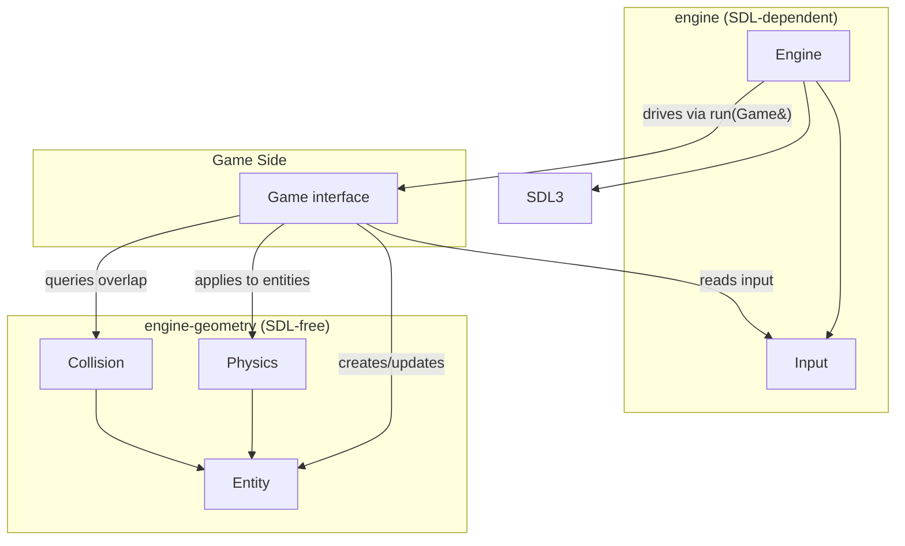
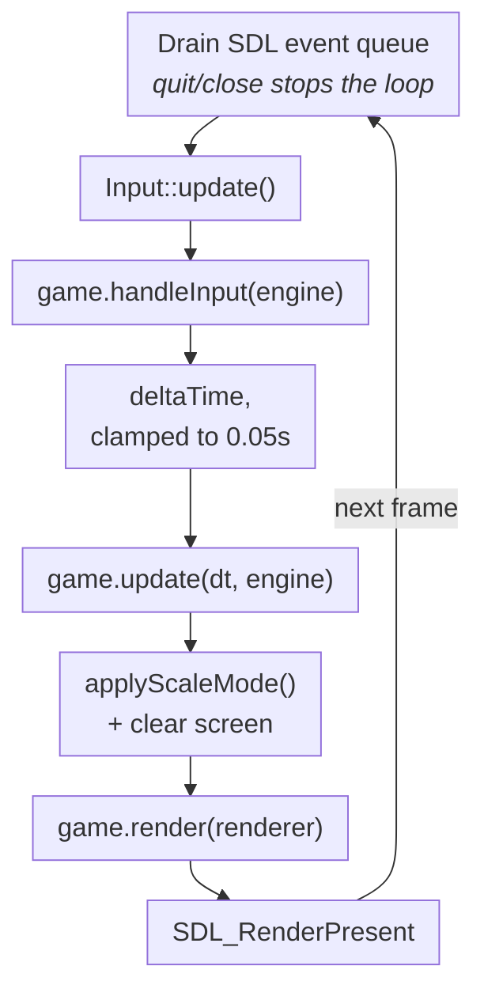
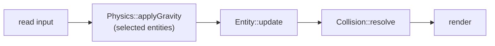
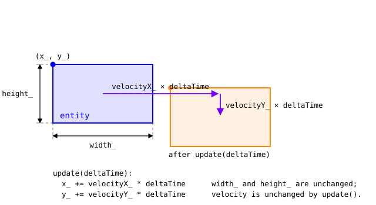
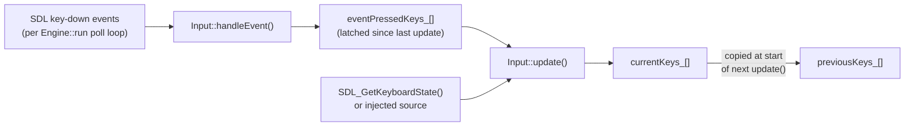
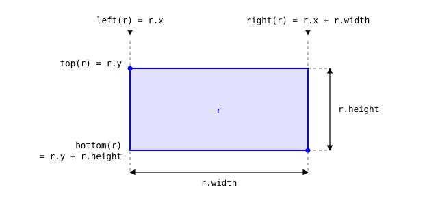
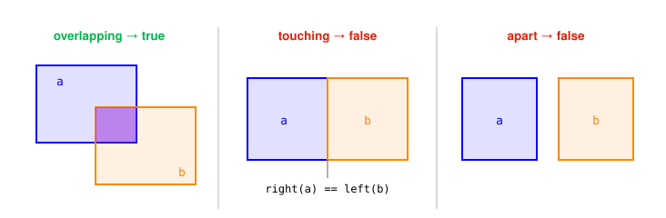
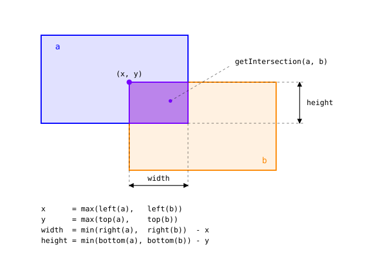
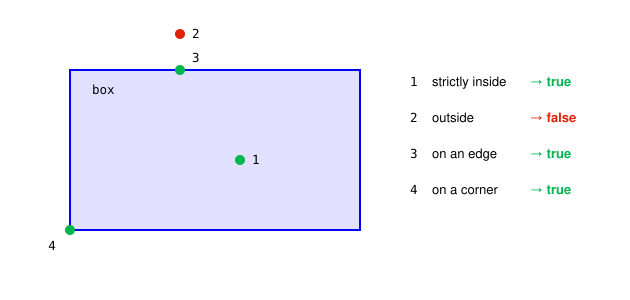

# Milestone 1: Team Engine Design

CSC 581 Game Engine Foundation

Team 17: Vanaja Agarwal, Harsha Puvvadi, Seojin Kim

Source Code: https://github.com/CSC581/shared-engine/tree/main

## Overview & Architecture

### What the engine is

The engine is a small foundation for building 2D games with SDL3. It is
split into two CMake libraries:

- **`engine-geometry`** — SDL-free: `Entity`, `Physics`, `Collision`. Pure
  geometry and math, so it needs no window or renderer.
- **`engine`** — SDL-dependent: `Engine`, `Input`. Publicly links
  `engine-geometry` and `SDL3::SDL3`, so any game that links `engine` gets
  everything transitively.

A game does not subclass or modify the engine. Instead it implements the
`Game` interface and hands an instance to `Engine::run()`. The engine owns
the window, renderer, main loop, and timing; it knows nothing about players,
enemies, or scores.

### Design approach

The engine takes an **object-oriented** approach, in three specific senses:

- **Encapsulation.** `Engine` and `Entity` keep all state private and expose
  it only through member functions, so a game can never put an object into an
  inconsistent state by writing a field directly.
- **Polymorphism at one seam.** `Game` is an abstract base class of three
  pure virtual functions. `Engine::run()` holds a `Game&` and calls through
  the virtual function table, so it drives any game without knowing the
  concrete type. This is the single extension point, and the reason the
  engine never needs to change when a new game is added.
- **RAII.** `Engine`'s constructor acquires the SDL subsystem, window, and
  renderer, and its destructor releases them in reverse order. Copy and move
  are deleted, so ownership of those raw handles is unique and cleanup
  happens exactly once.

Not everything is modelled as an object, deliberately. `Physics`, `Collision`,
and `Input` are all-`static` classes used as namespaces: they hold either no
state (`Collision` is pure functions) or a single global (`Physics::gravity_`,
`Input`'s key arrays), so there is nothing per-instance worth constructing.
`Entity` is a concrete class with no virtuals rather than a base for a
`Player`/`Enemy` hierarchy — games compose it as a member instead of
inheriting from it.

### Subsystems

| System | Files | Covers |
| --- | --- | --- |
| Engine & Game | `Engine.hpp`, `Engine.cpp`, `Game.hpp` | Window/renderer setup, main loop, timing, render scaling, the game extension point |
| Entity | `Entity.hpp`, `Entity.cpp` | Position, size, velocity, bounding rectangle |
| Physics | `Physics.hpp`, `Physics.cpp` | Configurable gravity |
| Input | `Input.hpp`, `Input.cpp` | Keyboard state, just-pressed/just-released detection, multi-key queries |
| Collision | `Collision.hpp`, `Collision.cpp` | AABB overlap, intersection region, separation, overlap resolution |

### Architecture



`Engine` never references `Entity`, `Physics`, or `Collision` directly — it
only knows about `Game` and SDL. Everything below the `Game` line in the
diagram is code a game chooses to use; the engine does not require it.

### Per-frame lifecycle

`Engine::run(Game& game)` drives one iteration of this sequence every frame,
until the window is closed or `Engine::quit()` is called:



Why the order is what it is:

- The full event queue is drained even though the engine acts only on
  quit/close — that drain is what refreshes the array `SDL_GetKeyboardState()`
  reads. Other events go to `Input::handleEvent()`, latching keys tapped and
  released within one frame.
- `Input::update()` precedes both the scale-toggle check and
  `game.handleInput()`, so engine and game see identical key state.
- The frame timestamp is taken *after* `game.handleInput()`, so the measured
  interval covers the presented frame's own work.
- `applyScaleMode()` runs every frame, not just on resize, because it also
  resets the render scale to `1.0` before applying logical letterboxing.
- The engine clears before `game.render()` and presents after it returns, so
  `render()` only draws.

### Build

From the repository root:

```bash
cmake -S . -B build
cmake --build build
```

Wire a game executable in `CMakeLists.txt` and link the `engine` target,
which also puts `include/` on the include path:

```cmake
add_executable(my-game individual-games/<name>/myGame.cpp)
target_link_libraries(my-game PRIVATE engine)
```

Code that needs only geometry can link `engine-geometry` alone — it is
SDL-free and runs headless, with no window and no `SDL_Init`.

## Engine & Game

`Engine.hpp`/`Engine.cpp` — window, renderer, main loop, timing, and render
scaling. `Game.hpp` — the interface a game implements to plug into the engine.

### Using it from a game

A game subclasses `Game`, implements the three callbacks, constructs an
`Engine`, and hands the game to `Engine::run()`:

```cpp
// After defining MyGame with the three Game callbacks:
try {
    Engine engine("My Game", 800, 600);
    engine.setClearColor(30, 60, 140);
    MyGame game;
    engine.run(game);
} catch (const std::exception& error) {
    std::cerr << "Engine failed to start: " << error.what() << '\n';
}
```

Because both constructor failure paths throw `std::runtime_error`,
construction belongs inside a `try`/`catch` in `main()`.

### `Engine`

`Engine` holds no game state of its own. It owns SDL setup and the frame
loop, and drives whatever `Game` is passed to `run()`.

#### Construction and destruction

```cpp
Engine(const char* title, int width, int height);
~Engine();
```

- `width`/`height` are the **design resolution** — the coordinate space a
  game lays its entities out in, not necessarily the window's pixel size (see
  Scale modes below).
- `SDL_Init(SDL_INIT_VIDEO)` runs first; on failure it throws
  `std::runtime_error` carrying `SDL_GetError()`'s message.
- `SDL_CreateWindowAndRenderer(...)` then creates an always-resizable window
  and its renderer together. If it fails, `SDL_Quit()` runs before throwing:
  the destructor never runs for an object whose constructor threw, so that
  call alone prevents a failed startup leaving SDL initialized.
- A private `applyScaleMode()` call finishes construction, so logical
  presentation matches the default `ScaleMode::Proportional` before the first
  frame.
- The destructor releases in reverse: renderer, window, `SDL_Quit()`.

Because `Engine` owns raw SDL handles with no reference-counting, all four
copy/move operations are deleted. Games must draw with `getRenderer()` or the
`SDL_Renderer*` passed to `Game::render`, and must never create a second
renderer or call `SDL_Quit()` while an `Engine` is alive.

#### Running the game

```cpp
void run(Game& game);
void quit();
```

- `run()` follows the lifecycle diagram above, blocking until `isRunning_`
  becomes `false`.
- `isRunning_` is cleared on `SDL_EVENT_QUIT`,
  `SDL_EVENT_WINDOW_CLOSE_REQUESTED`, or `engine.quit()`. `quit()` only flips
  the flag — the current frame still finishes before the loop exits.
- `deltaTime` is `(currentFrameTime - previousFrameTime) / 1000.0F` seconds
  from `SDL_GetTicks()`, capped at `0.05`. The cap keeps a stalled frame
  (window drag, breakpoint) from causing a large physics jump. There is no
  minimum clamp or fixed-timestep accumulator — the timestep is variable.
  `previousFrameTime` advances to the raw timestamp even when the delta is
  clamped, so time never accumulates a debt.

Games read keys through the polling `Input` API, never from `SDL_Event`
directly. The clamp is a soft guard against a stalled frame teleporting a
fast mover through a thin wall, not continuous collision detection.

#### Renderer and design-resolution accessors

```cpp
SDL_Renderer* getRenderer() const;
int getWidth() const;
int getHeight() const;
```

- `getRenderer()` is the only supported way to obtain the renderer; games
  should not create their own.
- `getWidth()`/`getHeight()` return the design resolution passed to the
  constructor (constant for the `Engine`'s lifetime), not the current window
  pixel size. Games position entities in this coordinate space regardless of
  scale mode.

#### Clear color

`Engine::Color` holds `std::uint8_t` channels `red`, `green`, `blue`; default
`{30, 60, 140}`, alpha always `255`.

```cpp
void setClearColor(Color color);
void setClearColor(std::uint8_t red, std::uint8_t green, std::uint8_t blue);
```

The screen clears to `clearColor_` at the start of every frame's render step,
before `game.render()` runs. `setClearColor` may be called any time (e.g. from
`update()`) and takes effect starting with that same frame's clear.

#### Scale modes

```cpp
ScaleMode getScaleMode() const;
void setScaleMode(ScaleMode mode);
void toggleScaleMode();
void setScaleToggleKey(SDL_Scancode key);
```

Games always draw in design-resolution coordinates (`getWidth()` x
`getHeight()`). `applyScaleMode()` (private; called once from the constructor
and once per frame from `run()`) is the single place that maps those
coordinates onto window pixels.

| Mode | Behavior |
| --- | --- |
| `Constant` | `SDL_LOGICAL_PRESENTATION_DISABLED`. One design unit maps to one screen pixel, regardless of window size. Resizing reveals more or less of the world rather than scaling it. |
| `Proportional` (default) | Logical presentation with `SDL_LOGICAL_PRESENTATION_LETTERBOX` at the design width/height. Uniform scale preserving the design aspect ratio; unused space is letterboxed rather than stretched. |

- `setScaleMode()` sets the mode directly; `toggleScaleMode()` flips between
  the two. Both only touch the field and never talk to SDL, so the change
  takes effect on the next presented frame regardless of caller.
- `scaleToggleKey_` defaults to `SDL_SCANCODE_F1`. Each frame, if the key
  isn't `SDL_SCANCODE_UNKNOWN` and `Input::isKeyJustPressed(scaleToggleKey_)`
  is true, `run()` calls `toggleScaleMode()` itself — no wiring needed. This
  check runs before `handleInput`, so a game reading the same key sees the
  mode already in effect for the frame.
  `setScaleToggleKey(SDL_SCANCODE_UNKNOWN)` disables the built-in toggle; any
  other scancode rebinds it.

`applyScaleMode()` resets render scale to `(1, 1)` first so the two mechanisms
can never compound — any prior mode's or game's leftover scale is wiped before
the new presentation is set. `Proportional` relies on letterboxing rather than
separate horizontal and vertical scale factors, which would stretch the image
and distort the design aspect ratio.

#### Private state

All state is private; games reach it only through the public functions above.

| Variable | Type | Purpose |
| --- | --- | --- |
| `maxDeltaTime` | `static constexpr float` (= `0.05F`) | Upper bound on a frame's delta time, in seconds. |
| `defaultClearColor` | `static constexpr Color` (= `{30, 60, 140}`) | Clear colour a new engine starts with. |
| `window_` | `SDL_Window*` | The window, destroyed by the destructor. |
| `renderer_` | `SDL_Renderer*` | The one renderer; handed to `Game::render` each frame. |
| `width_`, `height_` | `int` | Design resolution, fixed at construction. |
| `clearColor_` | `Color` | Colour the loop clears to each frame. |
| `scaleMode_` | `ScaleMode` | Design-units-to-pixels mapping; `Proportional` by default. |
| `scaleToggleKey_` | `SDL_Scancode` | Built-in toggle key; F1 by default, `SDL_SCANCODE_UNKNOWN` disables it. |
| `isRunning_` | `bool` | Loop condition; cleared by `quit()` or a close event. |

### `Game`

```cpp
virtual void handleInput(Engine& engine) = 0;
virtual void update(float deltaTime, Engine& engine) = 0;
virtual void render(SDL_Renderer* renderer) const = 0;
```

`Game` is the engine's only extension point: a game subclasses it and passes
an instance to `Engine::run()`. `Engine` calls exactly one of each method per
frame, in this order:

| Method | When | Responsibility |
| --- | --- | --- |
| `handleInput` | After `Input::update()`, so every `Input::` query reflects this frame | Read keys, set intent: velocity, jump flags, `engine.setScaleMode()`, `engine.quit()`. |
| `update` | After delta time is computed and clamped | Advance simulation: `Physics::applyGravity`, `Entity::update`, `Collision::resolve`, camera. |
| `render` | After clear and scale apply | Draw only. The engine calls `SDL_RenderPresent` when this returns, so `render()` must not clear or present. It is `const`, so it should not mutate game state. |

`deltaTime` is in **seconds** and already clamped by the loop; games should
not re-clamp it. `Game` has a virtual destructor and no other state, a game
need not store an `Engine` reference beyond what's passed into each call.

A typical per-frame order inside a game's own code (not enforced by the
engine):




## Entity

`Entity.hpp`/`Entity.cpp` — the generic game object: position, size, and
velocity, plus a bounding rectangle. It has no knowledge of rendering,
input, or any specific game; it is pure state and simple motion.

### Using it from a game

```cpp
Entity player(100.0F, 200.0F, 32.0F, 32.0F);
player.setVelocity(200.0F, 0.0F);

// During the game's update:
player.update(deltaTime);
```

Each Entity starts with zero velocity, so it stays still until a setter or
gravity changes it. For falling entities, call `Physics::applyGravity(player,
deltaTime)` before `player.update(deltaTime)`. Both calls are explicit, the
engine never applies gravity or moves Entities on its own, so a stationary
platform can skip both and a flying object can move without gravity.

### `Rect`

A plain axis-aligned rectangle: `x`/`y` is the top-left corner, `width`/
`height` extend right and down from it. `Rect` is a value type with no
behavior of its own, the Collision section supplies the geometry
operations on it.

### Construction and state

```cpp
Entity(float x, float y, float width, float height);
```

An `Entity` stores position (`x_`, `y_`), size (`width_`, `height_`), and
velocity (`velocityX_`, `velocityY_`). Velocity is default-initialized to
`0.0F` in the class definition and not touched by the constructor, so a newly
created entity is stationary until a velocity setter is called.

| Variable | Type | Purpose |
| --- | --- | --- |
| `x_`, `y_` | `float` | Top-left position of this Entity. |
| `width_`, `height_` | `float` | Width and height of this Entity's rectangle. |
| `velocityX_`, `velocityY_` | `float` | Movement in units per second; both start at `0.0F`. |

All state is private. Each Entity owns its own copy, so changing one Entity's
velocity never affects another.



### Motion

```cpp
void update(float deltaTime);
```

`update()` performs simple explicit (forward) Euler integration of velocity
into position, each axis advances by that axis's velocity times `deltaTime`:

```
x += velocityX * deltaTime
y += velocityY * deltaTime
```

It does not touch velocity itself: anything that changes velocity over time
(gravity, acceleration, drag) is a separate step the game performs before
calling `update()`, most commonly via `Physics::applyGravity`. There is no
maximum-speed clamp, drag, or friction built in.

`deltaTime` is in seconds and velocity is in units per second, so a
horizontal velocity of `200.0F` moves the Entity 100 units in half a second.
Scaling by elapsed time keeps movement consistent across frame rates.

### Setters and getters

```cpp
void setPosition(float x, float y);
void setSize(float width, float height);
void setVelocity(float velocityX, float velocityY);
void setVelocityX(float velocityX);
void setVelocityY(float velocityY);
float getX() const;
float getY() const;
float getVelocityX() const;
float getVelocityY() const;
Rect getBounds() const;
```

- `setPosition`/`setSize` overwrite both axes/dimensions at once.
  `setPosition` leaves velocity intact, so a moving Entity keeps moving from
  its new position on the next `update()`; use it to place, teleport, or
  reset. No setter moves the Entity, position changes only in `update()`.
- `setVelocityX`/`setVelocityY` change one axis without disturbing the other,
  used for example, when `Collision::resolve` zeroes velocity on only the
  axis it pushed along.
- `getBounds()` returns a fresh `Rect{x_, y_, width_, height_}` **by value**,
  computed on every call rather than cached. It always reflects current
  position and size, but the returned `Rect` is disconnected from the Entity:
  editing it has no effect, and it does not track later movement.
- There are no direct getters for size; read `width_`/`height_` via
  `getBounds()`.

### Collision convenience methods

```cpp
bool collidesWith(const Entity& other) const;
bool containsPoint(float x, float y) const;
```

These are declared on `Entity` (in `Entity.hpp`) but **implemented in
`Collision.cpp`**, not `Entity.cpp`. They delegate to
`Collision::intersects(*this, other)` and `Collision::contains(getBounds(), x,
y)`.

This split is intentional: it lets a game write the natural
`player.collidesWith(wall)` call on `Entity` itself, while keeping
`Entity.cpp`/`Entity.hpp` free of any dependency on the collision system —
`Entity` depends only on its own header; `Collision.cpp` depends on both.


## Physics

`Physics.hpp`/`Physics.cpp`: a single configurable value (gravity) and one
function that applies it to an entity. It depends only on `Entity`, not on
`Engine` or SDL.

### API

```cpp
static void setGravity(float gravity);
static float getGravity();
static void applyGravity(Entity& entity, float deltaTime);
```

Everything on `Physics` is static: the class is effectively a namespace
holding one piece of shared, global data: `gravity_`.

| Variable | Type | Purpose |
| --- | --- | --- |
| `gravity_` | `static float` | Acceleration used by every `applyGravity()` call; defaults to `980.0F`, in units per second squared. |

- `980.0F` corresponds to roughly Earth gravity when a design unit is treated
  as a centimeter (or as an arbitrary "pixels per second squared" value a game
  is free to reinterpret).
- `setGravity()` overwrites `gravity_` for all subsequent `applyGravity`
  calls, on any entity — there is no per-entity gravity scale.
- `applyGravity(entity, deltaTime)` only **adds to vertical velocity**; it
  does not move the entity. Gravity accumulates onto whatever `velocityY`
  already is, so calling it every frame produces an accelerating fall;
  position changes only when `update(deltaTime)` runs afterward. With gravity
  at `980.0F`, a call with `deltaTime == 0.5F` adds `490.0F` to vertical
  velocity; horizontal velocity and position are unchanged.
- Positive gravity accelerates in the positive Y direction; negative gravity
  pushes entities upward instead.
- Setting gravity to `0.0F` or skipping `applyGravity` for a frame stops
  it *adding* velocity but does **not** clear velocity an Entity already has;
  an entity already falling keeps falling at its current speed.

### Usage pattern

Gravity is opt-in per entity and per frame: nothing calls it automatically.
A game decides which entities should fall and calls it from its own
`update()`:

```cpp
Physics::setGravity(980.0F);

// each frame, for entities that should fall:
Physics::applyGravity(player, deltaTime);
player.update(deltaTime);
```

Order matters: gravity changes velocity first, then movement uses that new
velocity the same frame. Reversing the calls makes an entity move on the
previous frame's velocity.

Because `gravity_` is a single static value, giving different entities
different gravity simultaneously (e.g. a slow-motion pickup affecting only one
entity) requires scaling the effect manually by calling `setGravity` with a
different value before applying it and restoring it afterward, or by skipping
`applyGravity` for that entity and adding vertical velocity by hand.


## Input

`Input.hpp`/`Input.cpp`: keyboard state for games built on the engine.

`Input` is part of `engine` (SDL-dependent), not `engine-geometry`, because
it reads `SDL_GetKeyboardState` and consumes `SDL_Event`s. Everything on it
is static (global) state, similar in spirit to `Physics`.

### Design: polling plus event latching

Games query key state by polling (`Input::isKeyPressed(...)`), but a key
that is pressed and released entirely between two polls would otherwise be
lost. `Input` solves this with two inputs feeding one piece of state:



`Engine::run()` calls `Input::handleEvent(event)` for every polled SDL event
(after checking for quit/close itself), and `Input::update()` once per frame
before `game.handleInput()` runs. Game code normally calls only the query
methods below; `handleEvent()` and `update()` are engine-driven.

### Using it from a game

```cpp
// Inside Game::handleInput():
const float dx = Input::getAxis(SDL_SCANCODE_A, SDL_SCANCODE_D);
const float dy = Input::getAxis(SDL_SCANCODE_W, SDL_SCANCODE_S);
player_.setVelocity(dx * speed_, dy * speed_);

if (Input::isKeyJustPressed(SDL_SCANCODE_SPACE)) {
    jump();
}
```

### State arrays

`keyCount = SDL_SCANCODE_COUNT`: every SDL scancode has its own slot, so any
number of keys can read as held simultaneously (diagonal movement, run + jump,
modifier chords, two players on one keyboard) with no special-casing.
`isValidKey` guards every public lookup so an out-of-range `SDL_Scancode`
cannot read or write outside the arrays.

| Variable | Type | Purpose |
| --- | --- | --- |
| `keyCount` | `static constexpr int` (= `SDL_SCANCODE_COUNT`) | Size of every key array, and the valid scancode range. |
| `currentKeys_` | `std::array<bool, keyCount>` | Keys held during the current frame. |
| `previousKeys_` | `std::array<bool, keyCount>` | Last frame's `currentKeys_`. |
| `eventPressedKeys_` | `std::array<bool, keyCount>` | Key-downs latched by `handleEvent()` since the last `update()`; merged into `currentKeys_` and cleared each frame. |
| `stateSource_` | `const bool*` | Injected keyboard array, or `nullptr` to read real hardware. |
| `stateSourceKeyCount_` | `int` | Entries in `stateSource_`; `0` when there is no injected source. |

All state is private and static. All three arrays are indexed directly by
`SDL_Scancode`, so `currentKeys_[SDL_SCANCODE_W]` is the state of the W key.

#### `Input::update()`

Each call:

1. Copies `currentKeys_` into `previousKeys_`, so this frame's state becomes
"last frame" for just-pressed/just-released detection. 2. Resets
`currentKeys_` to all-`false`, then reads the active keyboard-state source
into it. Only `min(availableKeys, keyCount)` entries are copied, so a shorter
source array cannot overrun `currentKeys_`; clearing first keeps a key that
disappears from the source from sticking. 3. ORs in any scancode latched by
`handleEvent()` since the last `update()`, so a key tapped and released
between two polls still reads as pressed for exactly one frame. The latch only
ever forces a key *on* — it can extend a press by one frame, never suppress
one. 4. Clears `eventPressedKeys_` for the next frame.

#### `Input::handleEvent(const SDL_Event& event)`

Only fresh key-down events are latched (`event.key.repeat` is ignored, so OS
key-repeat does not re-trigger anything); key-up events are not handled here —
releases are detected only through the polling path in `update()`.

### Query API

```cpp
static bool isKeyPressed(SDL_Scancode key);
static bool isKeyJustPressed(SDL_Scancode key);
static bool isKeyJustReleased(SDL_Scancode key);
```

- `isKeyPressed(key)` — `currentKeys_[key]` is true this frame (held,
  regardless of how long).
- `isKeyJustPressed(key)` — true this frame, false last frame. Fires for
  exactly one frame per press, including presses latched via
  `handleEvent()`.
- `isKeyJustReleased(key)` — false this frame, true last frame. Fires for
  exactly one frame per release.
- All three return `false` for an out-of-range scancode.

#### Multi-key helpers

```cpp
static bool areAllKeysPressed(std::initializer_list<SDL_Scancode> keys);
static bool isAnyKeyPressed(std::initializer_list<SDL_Scancode> keys);
static int pressedKeyCount();
static std::vector<SDL_Scancode> getPressedKeys();
static float getAxis(SDL_Scancode negativeKey, SDL_Scancode positiveKey);
```

- `areAllKeysPressed({...})`: every listed key is held; useful for chords and
  modifier combos. An **empty** list returns `false`, not vacuously `true`: an
  explicit check is needed because `std::all_of` over an empty range is
  `true`, which would make an empty chord fire every frame.
  `isAnyKeyPressed({...})` needs no such guard, since `std::any_of` already
  returns `false` for an empty range.
- `pressedKeyCount()`: count of scancodes currently pressed, across the whole
  keyboard.
- `getPressedKeys()`: currently-pressed scancodes, ascending order. Allocates
  a `std::vector` per call, so it belongs in rebinding screens, debug
  overlays, and logging rather than a hot per-frame path.
- `getAxis(negativeKey, positiveKey)`: `-1.0F` if only `negativeKey` is held,
  `+1.0F` if only `positiveKey` is held, `0.0F` if neither or **both** are.
  Uses two independent `if` statements rather than `if`/`else`, so opposing
  keys cancel instead of one silently winning. Calling it twice with two axis
  pairs (e.g. A/D and W/S) gives a full 8-way direction with no extra
  bookkeeping.

### Keyboard state source

```cpp
static void setKeyboardStateSource(const bool* keyboardState, int keyCount);
```

By default `update()` reads from `SDL_GetKeyboardState`. Calling
`setKeyboardStateSource(myArray.data(), myArray.size())` swaps that for an
arbitrary `bool` array, so a caller can supply keyboard state without any
real SDL event loop or window. Passing `nullptr` restores real hardware
reads. This is the only supported way to feed `Input` a synthetic state.

The injected array is **not copied** — only the pointer and length are
stored — so it must outlive every `update()` call that reads it. The length
is reset to `0` whenever the pointer is null, so a stale length can never be
paired with a null pointer.


## Collision

`Collision.hpp`/`Collision.cpp` — axis-aligned bounding-box (AABB)
collision geometry.

`Collision` only answers geometric questions — "are these two boxes
overlapping, and by how much?" — and never decides what a game should do in
response. Deciding what a collision *means* (stop the player, take damage,
trigger a checkpoint) is entirely up to the game.

All methods are `static` and `Collision` holds no state. Because every entry
point is a pure function of its arguments, the same inputs always give the
same answer, and nothing has to be initialised or reset between frames.

### Using it from a game

Include `Collision.hpp` and call the static functions — there is no
`Collision` instance to construct. This excerpt assumes `player` and `coin`
are Entities and `button` is a Rect:

```cpp
if (Collision::intersects(player, coin)) {
    collectCoin();
}

const Rect overlap = Collision::getIntersection(player, coin);

if (Collision::contains(button, mouseX, mouseY)) {
    press();
}
```

`Entity` also exposes two conveniences that read more naturally at the call
site `player.collidesWith(wall)` and `player.containsPoint(mouseX, mouseY)`
 declared in `Entity.hpp` but implemented here; see the Entity section for
why.

#### Where it goes in the frame

Inside `Game::update()`, after the engine has already run `handleInput()`:

```text
Physics::applyGravity(...)   // optional, per entity
entity.update(deltaTime)     // integrate velocity into position
handleCollisions()           // detect / separate / resolve
// Game::render() then draws the resolved positions
```

Resolve **after** movement, so the overlap reflects this frame's integration.
The engine's `deltaTime` clamp (`Engine::maxDeltaTime`, 0.05 s) limits how
far an entity can travel in one step, but it does not replace careful
collision logic for thin surfaces.

### Geometry conventions

`Collision.cpp` defines four unexported helpers — `left(rect)` (`rect.x`),
`right(rect)` (`rect.x + rect.width`), `top(rect)` (`rect.y`), and
`bottom(rect)` (`rect.y + rect.height`). Everything else in the file is
written in terms of these, so the edge convention lives in exactly one place.

The geometry they work on is `Rect`, declared in `Entity.hpp`, with the
origin at the box's **top-left**:

| Field | Type | Meaning |
| --- | --- | --- |
| `x` | `float` | Left edge, in world units. |
| `y` | `float` | Top edge (y grows downward, as in SDL). |
| `width` | `float` | Extent to the right of `x`. |
| `height` | `float` | Extent below `y`. |

Because y increases downward, moving "up" climbing or jumping means
*decreasing* `y` and a *negative* `velocityY`. `Entity::getBounds()` builds a
`Rect` from an entity's position and size.



### Overlap detection

```cpp
static bool intersects(const Rect& a, const Rect& b);
static bool intersects(const Entity& a, const Entity& b);
```

- **Touching edges do not count as a collision**: the comparisons are
  strict (`<`/`>`, not `<=`/`>=`), so two boxes that share exactly one edge
  (e.g. one ends at `x=100` and the other starts at `x=100`) are reported as
  not intersecting. That is what lets a game slide an entity flush against a
  wall without the wall reporting a hit every frame.
- **A zero-size box never collides with anything**, including itself, 
  guarded explicitly before the geometric check.
- **An entity does overlap itself** (same box, positive size), and detection
  is symmetric: `intersects(a, b) == intersects(b, a)`.
- **A fully-contained box does count as intersecting** its container.
- The `Entity` overload simply calls the `Rect` overload on
  `a.getBounds()`/`b.getBounds()`.



### Intersection region

```cpp
static Rect getIntersection(const Rect& a, const Rect& b);
static Rect getIntersection(const Entity& a, const Entity& b);
```

Returns the overlapping rectangle: `{0, 0, 0, 0}` if the boxes do not
intersect per `intersects()` above, which also means touching-only boxes
report a zero-size intersection, not a zero-width sliver at the shared edge.
When they do overlap, the result spans the larger left/top edges
(`x = max(left(a), left(b))`, `y = max(top(a), top(b))`) to the smaller
right/bottom ones (`width = min(right) - x`, `height = min(bottom) - y`),
useful for a game that wants to react to *how deep* an overlap is, not just
whether one exists.

Past the guard both extents are guaranteed positive, because the boxes are
known to overlap strictly. So a zero width and height always mean "no
intersection", and depth-based reactions need no separate check.



### Point containment

```cpp
static bool contains(const Rect& box, float x, float y);
```

Inclusive on all four edges, unlike `intersects`, which is exclusive, a
point exactly on the boundary or a corner counts as contained. A click on a
button's border should press it.



### Separation and resolution

#### `getSeparation`

```cpp
static bool getSeparation(const Entity& moving, const Entity& blocker,
                          float& outX, float& outY);
```

Computes the smallest push, along a single axis, that would separate
`moving` from `blocker`:

1. Compute the overlap rectangle between `moving` and `blocker` via
   `getIntersection`. If either dimension is `<= 0`, there is no collision:
   return `false` and leave `outX`/`outY` untouched.
2. Pick the axis with the **smaller overlap dimension** — that is the
   shallowest penetration, and pushing along it is the minimal correction:
   - If `overlap.width < overlap.height`: push along X. Direction is `-1` if
     `moving`'s horizontal center is left of `blocker`'s center, else `+1`.
     `outX = overlap.width * direction`, `outY = 0`.
   - Otherwise: push along Y, using the same center comparison on the
     vertical axis, with `outY = overlap.height * direction`, `outX = 0`.
3. Return `true` and write `outX`/`outY`.

Only one axis is ever pushed — this is a single-axis minimum-translation
resolution, not a full 2D minimum-translation-vector solve. When the overlap
is exactly square (`width == height`), the `<` comparison means the
**vertical** axis is chosen (ties go to Y/height). The center comparison uses
`left(a) + right(a)`: a doubled midpoint, since the factor of two cancels
and no division is needed.

`getSeparation()` reports the push instead of applying it, so a game can
inspect the direction before deciding what to do:

```cpp
float pushX = 0.0F;
float pushY = 0.0F;

if (Collision::getSeparation(player, platform, pushX, pushY)) {
    if (pushY < 0.0F) {
        // Pushed upward, so treat this as a landing candidate.
    }
}
```

#### `resolve`

```cpp
static bool resolve(Entity& moving, const Entity& blocker);
```

Convenience response built directly on `getSeparation`. It moves `moving` out
of `blocker` by the separation vector and zeroes velocity **only on the axis
that was pushed** — resolving a vertical landing zeroes `velocityY` (stops
the fall) but leaves `velocityX` untouched (horizontal movement survives
landing on the ground), and vice versa for a horizontal wall push. It returns
`false` and leaves `moving` unmodified if the two were not overlapping.

### Worked examples

**Detect only.** The game supplies the whole response:

```cpp
if (player.collidesWith(hazard)) {
    player.setPosition(spawnX, spawnY);
    player.setVelocity(0.0F, 0.0F);
}
```

**Stop against a wall.** A shallow horizontal overlap pushes sideways and clears
`velocityX` only:

```cpp
Entity player(90.0F, 0.0F, 100.0F, 100.0F);
player.setVelocity(500.0F, 200.0F);
Entity wall(180.0F, 0.0F, 100.0F, 100.0F);

Collision::resolve(player, wall);
// player.x == 80, velocityX == 0, velocityY still 200
```

**Land on the ground.** A shallow vertical overlap pushes up and clears
`velocityY` only:

```cpp
Entity faller(0.0F, 95.0F, 100.0F, 100.0F);
faller.setVelocity(50.0F, 300.0F);
Entity ground(0.0F, 180.0F, 400.0F, 100.0F);

Collision::resolve(faller, ground);
// faller.y == 80, velocityY == 0, velocityX still 50
```
